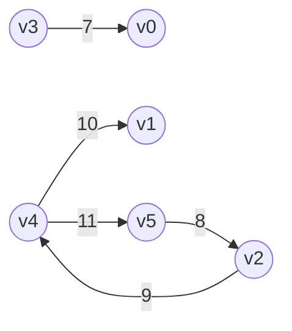
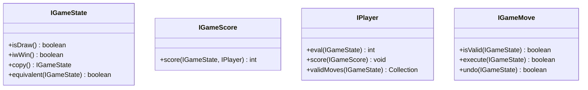
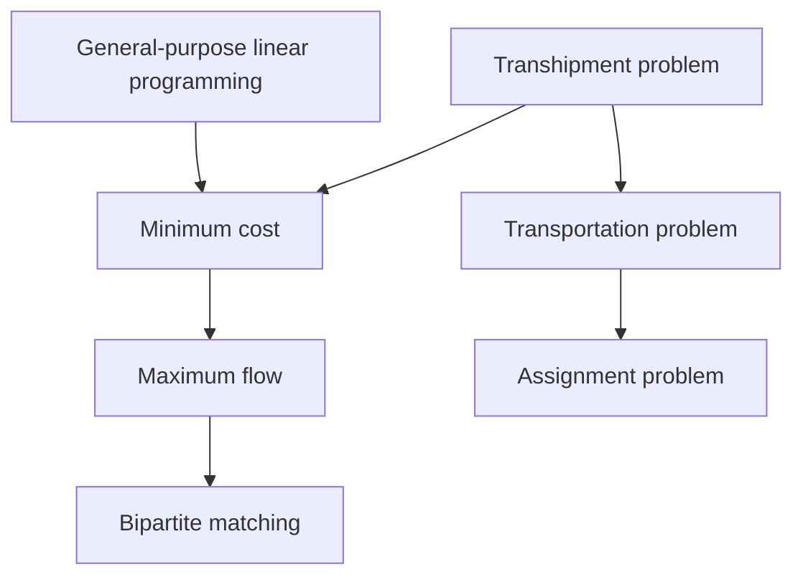
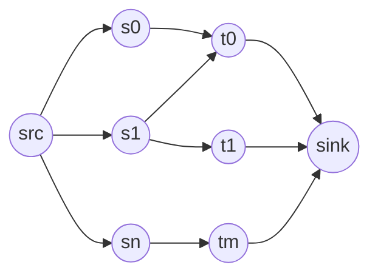
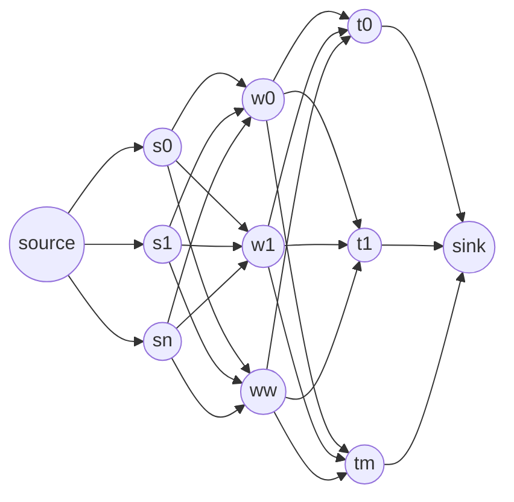

# enjoy algorithms

see [ALGORITHMS IN A NUTSHELL Second Edition](https://www.oreilly.com/library/view/algorithms-in-a/9781491912973/)

# sort

| name | example |
| :----- | :----- |
| insertion sort | exists |
| selection sort | exists |
| bubble sort | exists |
| heap sort | exists |
| quick sort | exists |
| bucket sort | exists |
| merge sort | exists |
| cocktail shaker sort | exists |
| shell sort | none |
| odd even sort | none |
| gnome sort | none |
| comb sort | none |
| circle sort | none |
| cycle sort | none |
| smooth sort | none |
| tournament sort | none |
| patience sort | none |
| unbalanced tree sort | none |
| counting sort | none |
| pigeonhole sort | none |
| gravity sort | none |
| american flag sort | none |
| radix sort | none |
| flash sort | none |
| shatter sort | none |
| time sort | none |
| bitonic sort | none |
| recursive pairwise sorting network | none |
| hybrid comb sort | none |
| tim sort | none |
| wiki sort | none |
| grail sort | none |
| sqrt sort | none |
| introspective sort[std::sort] | none |
| pancake sorting | none |
| bad sort | none |
| stooge sort | none |
| silly sort | none |
| slow sort | none |
| bogo sort | none |

## insertion sort

[source code](./erlang_code/sort/insertion_sort.erl)

<details><summary>sort logic</summary>

```erlang
sort(L) when 1 >= length(L) -> 
  L;
sort(L) ->
  sort(L, fun(A, B) -> compare(A, B) end).
sort(L, F) ->
  % when occured insertion then retry
  case sort(L, F, false) of
    {L1, true} -> sort(L1, F);
    {L1, false} -> L1
  end.
sort(L, F, Insertion) ->
  sort([], L, F, Insertion).
sort(Front, Rear, _, Insertion) when 1 >= length(Rear) ->
  {lists:append(Front, Rear), Insertion};
sort(Front, Rear, F, Insertion) ->
  [H1, H2 | T] = Rear,
  case F(H1, H2) of
    greater_than -> 
      insertion(H1, Front, [H2 | T], F);
    _ ->
      Front1 = lists:append(Front, [H1]),
      Rear1 = [H2 | T],
      sort(Front1, Rear1, F, Insertion)
  end.

-spec insertion(
  T, 
  list(T), 
  list(T), 
  fun((T, T) -> greater_than | equal_to | lower_than)) -> {list(T), true | false}.
insertion(Value, Front, Rear, _) when 0 >= length(Rear) ->
  {lists:append(Front, [Value]), true};
insertion(Value, Front, Rear, F) ->
  [H1 | T] = Rear,
  case F(Value, H1) of
    greater_than ->
      Front1 = lists:append(Front, [H1]),
      insertion(Value, Front1, T, F);
    _ ->
      Front1 = lists:append(Front, [Value]),
      L = lists:append(Front1, Rear),
      {L, true}
  end.
```

</details>

## selection sort

[source code](./erlang_code/sort/selection_sort.erl)

<details><summary>sort logic</summary>

```erlang
-spec sort(list(T)) -> list(T).
sort(L) when 1 >= length(L) ->
  L;
sort(L) ->
  sort(
    L, 
    fun(A, B) -> compare(A, B) end,
    length(L)).

-spec sort(
  list(T), 
  fun((T, T) -> greater_than | equal_to | lower_than),
  integer()) -> list(T).
sort(L, _, 0) ->
  L;
sort(L, F, N) ->
  {MaxValue, L1} = get_max_value(L, F, []),
  L2 = lists:append(L1, [MaxValue]),
  sort(L2, F, N-1).

-spec get_max_value(
  list(T),
  fun((T, T) -> greater_than | equal_to | lower_than),
  list(T)) -> {T, list(T)}.
get_max_value(L, _, Retain) when 1 >= length(L) ->
  [H1|_] = L,
  {H1, Retain};
get_max_value(L, F, Retain) ->
  [H1, H2|T] = L,
  case F(H1, H2) of
    greater_than ->
      Retain1 = lists:append(Retain, [H2]),
      L1 = [H1 | T],
      get_max_value(L1, F, Retain1);
    _ ->
      Retain1 = lists:append(Retain, [H1]),
      L1 = [H2 | T],
      get_max_value(L1, F, Retain1)
  end.
```

</details>

## bubble sort

[source code](./erlang_code/sort/bubble_sort.erl)

<details><summary>sort logic</summary>

```erlang
sort(L) ->
  sort(L, fun(A, B) -> compare(A, B) end).
sort(L, _) when 1 >= length(L) ->
  L;
sort(L, F) ->
  case sort(L, F, false) of
    {L2, true} -> sort(L2, F);
    {L2, false} -> L2
  end.
sort(L, _, Move) when 1 >= length(L) ->
  {L, Move};
sort(L, F, Move) ->
  [A, B | T] = L,
  case F(A, B) of
    greater_than ->
      {Rest, _} = sort([A|T], F, Move),
      {[B|Rest], true};
    _ ->
      {Rest, Move2} = sort([B|T], F, Move),
      {[A|Rest], Move2}
  end.

```

</details>

## heap sort

[source code](./erlang_code/sort/heap_sort.erl)

<details><summary>sort logic</summary>

```erlang
sort(L) when length(L) =< 0 ->
  [];
sort(L) ->
  F = fun(A, B) -> compare(A, B) end,
  L1 = build_heap(L, F),
  N = length(L1),
  sort(L1, F, N).
sort(L, _, I) when I =< 1 ->
  L;
sort(L, F, I) ->
  L1 = swap(L, 1, I),
  L2 = heap_sort(L1, F, 1, I),
  sort(L2, F, I - 1).

build_heap(L, F) ->
  N = length(L),
  I = trunc(N / 2),
  build_heap(L, F, I, N + 1).
build_heap(L, _, I, _) when I =< 0 -> L;
build_heap(L, F, I, N) ->
  L1 = heap_sort(L, F, I, N),
  build_heap(L1, F, I - 1, N).

-spec heap_sort(
  list(T),
  fun((T, T) -> greater_than | lower_than | equal_to),
  I, 
  I) -> list(T).
heap_sort(L, F, I, N) ->
  {LeftNodeIndex, RightNodeIndex} = get_child_index(I, N),
  RootNode = list_nth(I, L),
  LeftNode = list_nth(LeftNodeIndex, L),
  RightNode = list_nth(RightNodeIndex, L),
  case max_nodes(F, RootNode, LeftNode, RightNode) of
    right ->
      L1 = swap(L, I, RightNodeIndex),
      heap_sort(L1, F, RightNodeIndex, N);
    left ->
      L1 = swap(L, I, LeftNodeIndex),
      heap_sort(L1, F, LeftNodeIndex, N);
    _ ->
      L
  end.
```

</details>

## quick sort

[source code](./erlang_code/sort/quick_sort.erl)

<details><summary>sort logic</summary>

```erlang
-spec sort(list(T)) -> list(T).
sort(L) ->
  quick_sort(L).

-spec quick_sort(list(T)) -> list(T).
quick_sort([]) -> [];
quick_sort(L) when length(L) =:= 1 -> L;
quick_sort(L) when length(L) < 100 -> heap_sort:sort(L);
quick_sort(L) ->
  quick_sort(L, get_pivot_index(L)).
quick_sort(L, PivotIndex) when length(L) < PivotIndex ->
  heap_sort:sort(L);
quick_sort(L, PivotIndex) ->
  {L1, L2} = partition(L, PivotIndex),
  case L1 of
    L -> quick_sort(L, PivotIndex + 1);
    _ ->
      lists:append(
        quick_sort(L1),
        quick_sort(L2))
  end.
```

</details>

## bucket sort

[source code](./erlang_code/sort/bucket_sort.erl).

<details><summary>sort logic</summary>

```erlang
-spec sort(list(T)) -> list(T).
sort([]) -> [];
sort(L) ->
  sort(L, maps:new()).
sort([], Map) ->
  generate_list_from_map(Map, 1, [], maps:size(Map));
sort(L, Map) ->
  [#item{sort_value=Value}|T] = L,
  Map1 = case maps:is_key(Value, Map) of
    false ->
      maps:put(Value, [#item{sort_value=Value}], Map);
    true ->
      MapList = maps:get(Value, Map),
      RemovedMap = maps:remove(Value, Map),
      maps:put(Value, [#item{sort_value=Value} | MapList], RemovedMap)
  end,
  sort(T, Map1).

-spec generate_list_from_map(map(), integer(), list(T), integer()) -> list(T).
generate_list_from_map(_, _, L, Size) when Size =< 0 -> L;
generate_list_from_map(Map, I, L, _) ->
  {MapList, Map1} = case maps:is_key(I, Map) of
    true -> 
      List = maps:get(I, Map),
      RemovedMap = maps:remove(I, Map),
      {List, RemovedMap};
    false ->  {[], Map}
  end,
  L1 = lists:append(L, MapList),
  generate_list_from_map(Map1, I + 1, L1, maps:size(Map1)).
```

</details>

## merge sort

[source code](./erlang_code/sort/merge_sort.erl).

<details><summary>sort logic</summary>

```erlang
-spec sort(list(T)) -> list(T).
sort([]) -> [];
sort(L) when length(L) < 2 -> L;
sort(L) when length(L) =:= 2 -> 
  [Item1, Item2] = L,
  case compare(Item1, Item2) of
    greater_than -> swap(L, 1, 2);
    _ -> L
  end;
sort(L) ->
  SplitIndex = trunc(length(L) / 2),
  {L1, L2} = split_list(SplitIndex, L),
  SortedL1 = sort(L1),
  SortedL2 = sort(L2),
  merge(SortedL1, SortedL2).

-spec merge(list(T), list(T)) -> list(T).
merge(L1, L2) -> merge(L1, L2, []).
-spec merge(list(T), list(T), list(T)) -> list(T).
merge([], [], ResultList) -> ResultList;
merge(L1, [], ResultList) -> lists:append(ResultList, L1);
merge([], L2, ResultList) -> lists:append(ResultList, L2);
merge(L1, L2, ResultList) -> 
  [H1|T1] = L1,
  [H2|T2] = L2,
  case compare(H1, H2) of
    equal_to ->
      ResultList1 = lists:append(ResultList, [H1, H2]),
      merge(T1, T2, ResultList1);
    greater_than ->
      ResultList1 = lists:append(ResultList, [H2]),
      merge(L1, T2, ResultList1);
    lower_than ->
      ResultList1 = lists:append(ResultList, [H1]),
      merge(T1, L2, ResultList1)
  end.
```

</details>

## cocktail shaker sort


[source code](./erlang_code/sort/cocktail_shaker_sort.erl).

<details><summary>sort logic</summary>

```erlang
-spec sort(list(T)) -> list(T).
sort([]) -> [];
sort(L) ->
  sort(L, min, [], []).
sort([], _, Asc, Desc) ->
  lists:append(Asc, lists:reverse(Desc));
sort(L, Direction, Asc, Desc) ->
  case Direction of
    min ->
      {MinValue, L1} = choice_min_value(L),
      Asc1 = lists:append(Asc, [MinValue]),
      sort(L1, max, Asc1, Desc);
    max ->
      {MaxValue, L1} = choice_max_value(L),
      Desc1 = lists:append(Desc, [MaxValue]),
      sort(L1, min, Asc, Desc1)
  end.
```

</details>

# search

| name | example |
| :----- | :----- |
| sequential search | exists |
| binary search | exists |
| hash based search | exists |
| bloom filter | exists |
| binary search tree | exists |

## sequential search

[source code](./erlang_code/search/sequential_search.erl)

<details><summary>search logic</summary>

```erlang
-spec search(T, list(T)) -> T | not_found.
search(_, []) -> not_found;
search(Value, L) -> 
  [H|T] = L,
  case compare(Value, H) of
    equal_to -> H;
    _ -> search(Value, T)
  end.
```

</details>

## binary search

[source code](./erlang_code/search/binary_search.erl)

<details><summary>search logic</summary>

```erlang
-spec search(T, list(T)) -> T | not_found.
search(_, []) -> not_found;
search(Value, L) -> 
  search(Value, L, 1, length(L)).
search(_, _, Min, Max) when Min > Max -> not_found;
search(Value, L, Min, Max) -> 
  Index = trunc((Max + Min)  / 2),
  case compare(Value, lists:nth(Index, L)) of 
    equal_to -> Value;
    greater_than -> search(Value, L, Index + 1, Max);
    _ -> search(Value, L, Min, Index - 1)
  end.
```

</details>

## hash based search

[source code](./erlang_code/search/hash_based_search.erl)

<details><summary>search logic</summary>

```erlang
-spec search(T, list(T)) -> T | not_found.
search(_, []) -> not_found;
search(Value, L) -> 
  HashTable = create_hash_table(L),
  #item{value=SortValue} = Value,
  ValueHash = hash(SortValue),
  case maps:is_key(ValueHash, HashTable) of
    false -> not_found;
    true -> maps:get(ValueHash, HashTable)
  end.

-spec create_hash_table(list()) -> map().
create_hash_table(L) ->
  create_hash_table(L, maps:new()).
-spec create_hash_table(list(), map()) -> map().
create_hash_table([], Map) -> Map;
create_hash_table(L, Map) ->
  [H|T] = L,
  #item{value=SortValue} = H,
  Map1 = maps:put(hash(SortValue), H, Map),
  create_hash_table(T, Map1).
```

</details>

## bloom filter

see link

 + [Bloom filterの説明](http://dev.ariel-networks.com/column/tech/boom_filter/)
 + [Using Bloom Filters](https://www.perl.com/pub/2004/04/08/bloom_filters.html/)

[source code](./erlang_code/search/bloom_filter.erl)

<details><summary>search logic</summary>

```erlang
-spec search(T, list(T)) -> T | not_found.
search(_, []) -> not_found;
search(Value, L) -> 
  Mod = 1024,
  Filter = create_filter_table(L, Mod),
  ?OUTPUT_DEBUG(
     "filter: ~s", [[io_lib:format("~2.16.0B", [X]) || <<X:8>> <= Filter]]),
  filtered(Value, Filter, Mod).

-spec create_filter_table(list(), integer()) -> list().
create_filter_table(L, _) when length(L) =< 0 -> [];
create_filter_table(L, Mod) ->
  BitLength = convert_mod_to_bitlength(Mod),
  HashTable = <<0:BitLength>>,
  set_bit_to_filter_table(L, HashTable, Mod).
	
set_bit_to_filter_table([], HashTable, _) -> HashTable;
set_bit_to_filter_table(L, HashTable, Mod) ->
  BitLength = convert_mod_to_bitlength(Mod),
  [H|T] = L,
  HashValue = value_to_hash(H, Mod),
  HashTable1 = or_bit_string(HashTable, <<HashValue:BitLength>>),
  set_bit_to_filter_table(T, HashTable1, Mod).
```
</details>

## binary search tree

[source code](./erlang_code/search/binary_search_tree.erl)

<details><summary>search logic</summary>

```erlang
-spec search(T, list(T)) -> not_found | T.
search(_, []) -> not_found;
search(Value, L) ->
  ?OUTPUT_DEBUG("search/2: ~w", [start]),
  Tree = create_tree(L),
  ?OUTPUT_DEBUG("search/2: ~w", [create_tree_finish]),
  search_value(Value, Tree).

-spec search_value(T, list(T)) -> not_found | T.
search_value(Value, Tree) ->
  search_value(Value, Tree, 1).
search_value(_, Tree, Index) when length(Tree) < Index -> not_found;
search_value(Value, Tree, Index) ->
  [_, Node2Index, Node3Index] = get_node_indexes(Tree, Index),
  ?OUTPUT_DEBUG("search_value/3: comapre ~w, ~w", [Value, list_nth(Index, Tree)]),
  case compare(Value, list_nth(Index, Tree)) of
    greater_than ->
      search_value(Value, Tree, Node3Index);
    lower_than ->
      search_value(Value, Tree, Node2Index);
    equal_to -> Value
  end.
```
</details>

# Graph

vertex, edge, node, link, path, weight

 + undirected, unweighted graph
   + (u, v) = (v, u)
   + like a social network
 + directed graph
   + (u, v) /= (v, u)
 + weighted graph
   + weight(u, v)

ex) directed weighted graph.6 vertex, 5 edge.



data structure design

 + create
   + add vertex and edge
 + inspect
   + get graph infomation.directed or undirected.
   + get edge from vertex
   + get edge weight
 + update
   + add vertex, edge

## brute force

[source code](./erlang_code/graph/brute_force.erl)

<details><summary>search logic</summary>

```erlang
-spec search(list(T)) -> list(T).
search(L) ->
  % [[start, 1, 8, ..], [start, 2, 8, ...]]
  Routes = dfs_first_visit(start, L),
  FilteredRoutes = filter_route(Routes),
  show_routes(FilteredRoutes),
  ok.

dfs_first_visit(Route, L) ->
  Edges = get_vertex_edges(Route, L),
  dfs_first_visit(Route, L, Edges, []).
dfs_first_visit(_, _, [], Dist) -> Dist;
dfs_first_visit(Route, L, Edges, Dist) when is_list(Edges) ->
  [H|T] = Edges,
  % [[start, 1, 8, ...], [start, 1, 6, ...]]
  ResultRoute = dfs_visit([Route], H, L),
  Dist1 = lists:append(Dist, ResultRoute),
  % [[start, 1, 8, ...], [start, 1, 6, ...], [start, 2, 3, ...]]
  dfs_first_visit(Route, L, T, Dist1).

-spec dfs_visit(list(), integer() | stop | start, list()) -> list().
dfs_visit(Route, _, L) when length(Route) > length(L) -> Route;
dfs_visit(Route, Vertex, L) ->
  Route1 = lists:append(Route, [Vertex]),
  Edges = get_vertex_edges(Vertex, L),
  ExcludeVertexEdges = eliminate_vertex(Edges, Route),
  dfs_visit(Route1, ExcludeVertexEdges, L, []).

-spec dfs_visit(list(), list(), list(), list()) -> list().
dfs_visit(Route, [], _, Dist) -> 
  [Route | Dist];
dfs_visit(Route, Edges, L, Dist) ->
  [H|T] = Edges,
  ResultRoute = dfs_visit(Route, H, L),
  Dist1 = lists:append(Dist, ResultRoute),
  dfs_visit(Route, T, L, Dist1).
```

</details>

## depth first search

[source code](./erlang_code/graph/depth_first_search.erl)

<details><summary>search logic</summary>

```erlang
search(L) ->
  Route = dfs_visit(L, start),
  ?OUTPUT_DEBUG("create_route/2 - vertex: ~w", [Route]),
  show_routes(Route),
  ok.

-spec dfs_visit(list(T), integer() | start | stop) -> list(T).
dfs_visit(Nodes, TargetVertex) ->
  Nodes1 = set_node_status(Nodes, TargetVertex, gray),
  Edges = get_node_edges(Nodes, TargetVertex),
  Edges1 = choose_white_nodes(Nodes, Edges),
  dfs_visit(Nodes1, TargetVertex, Edges1).

-spec dfs_visit(list(T), integer() | start | stop, list(integer() | start | stop)) -> list(T).
dfs_visit(Nodes, TargetVertex, []) -> 
  set_node_status(Nodes, TargetVertex, black);
dfs_visit(Nodes, TargetVertex, Edges) ->
  [H|T] = Edges,
  Status = get_node_status(Nodes, H),
  ?OUTPUT_DEBUG("dfs_visit/3 - vertex: ~w, status; ~w", [H, Status]),
  Nodes1 = case Status of
    white ->
      set_node_period(Nodes, H, TargetVertex);
    _ -> Nodes
  end,
  Nodes2 = dfs_visit(Nodes1, H),
  dfs_visit(Nodes2, TargetVertex, T).

choose_white_nodes(_, []) -> [];
choose_white_nodes(Nodes, Edges) ->
  [H|T] = Edges,
  Targets = case get_node_status(Nodes, H) of
    white -> [H];
    _ -> []
  end,
  lists:append(Targets, choose_white_nodes(Nodes, T)).
```

</details>

## breadth first search

[source code](./erlang_code/graph/breadth_first_search.erl)

<details><summary>search logic</summary>

```erlang
search(L) ->
  Route = bfs_visit(L, start),
  show_routes(Route),
  ok.

bfs_visit(Nodes, Target) ->
  Queue = queue:new(),
  Queue1 = queue:in(Target, Queue),
  bfs_visit(Nodes, Target, Queue1).

bfs_visit(Nodes, Target, Queue) ->
  Node = queue:head(Queue),
  Edges = get_endges(Nodes, Node),
  {Nodes1, Queue1} = bfs_visit(Nodes, Node, Queue, Edges),
  case queue:len(Queue1) of
    0 ->  Nodes1;
    _  -> bfs_visit(Nodes1, Target, Queue1)
  end.

-spec bfs_visit(list(), integer() | stop | start, list(), list()) -> {list(), list()}.
bfs_visit(Nodes, Target, Queue, []) -> 
  {_, Queue1} = queue:out(Queue),
  Nodes1 = set_status(Nodes, Target, black),
  {Nodes1, Queue1};
bfs_visit(Nodes, Target, Queue, Edges) when is_list(Edges) ->
  [H|T]  = Edges,
  {Nodes1, Queue1} = bfs_visit(Nodes, Target, Queue, H),
  bfs_visit(Nodes1, Target, Queue1, T);
bfs_visit(Nodes, Target, Queue, Edge) ->
  case get_status(Nodes, Edge) of
    white ->
      Dist = get_dist(Nodes, Target),
      Nodes1 = set_dist(Nodes, Edge, Dist + 1),
      Nodes2 = set_period(Nodes1, Edge, Target),
      Nodes3 = set_status(Nodes2, Edge, gray),
      Queue1 = queue:in(Edge, Queue),
      {Nodes3, Queue1};
    _ -> 
      {Nodes, Queue}
  end.
```

</details>

## dijkstra's algorithm

[source code](./erlang_code/graph/dijkstra_algorithm.erl)

<details><summary>search logic</summary>

```erlang
search(L) ->
  Route = single_source_shortest(L, start),
  show_routes(Route),
  ok.

single_source_shortest(Nodes, StartVertex) -> 
  Nodes1 = set_dist(Nodes, StartVertex, 0),
  PQ = create_fist_priority_list(Nodes1),
  show_pq(PQ),
  {Nodes2, _} = calc_shortest_path(Nodes1, PQ),
  Nodes2.

calc_shortest_path(Nodes, []) -> {Nodes, []};
calc_shortest_path(Nodes, PQ) ->
  {Nodes1, PQ1} = case length(PQ) of
    0 -> {Nodes, PQ};
    _ ->
      {Vertex, RetainPQ} = get_min(PQ),
      ?OUTPUT_DEBUG("calc_shortest_path/2 - vertex: ~w", [Vertex]),
      Edges = get_edges(Nodes, Vertex),
      calc_shortest_path(Nodes, RetainPQ, Vertex, Edges)
  end,
  calc_shortest_path(Nodes1, PQ1).
calc_shortest_path(Nodes, PQ, _, [])  -> {Nodes, PQ};
calc_shortest_path(Nodes, PQ, MinVertex, Edges) ->
  [Edge|RetainEdges] = Edges,
  Weight = get_weight(Nodes, MinVertex, Edge#edge_record.vertex),
  MinVertexDist = get_dist(Nodes, MinVertex),
  EdgeDist = get_dist(Nodes, Edge#edge_record.vertex),
  Length = MinVertexDist + Weight,
  {Nodes1, PQ1} = case Length < EdgeDist of
    true ->
      DecreasePQ = decrease_priority(PQ, Edge#edge_record.vertex, Length),
      SetDistNodes = set_dist(Nodes, Edge#edge_record.vertex, Length),
      SetPeriodNodes = set_period(SetDistNodes, Edge#edge_record.vertex, MinVertex),
      {SetPeriodNodes, DecreasePQ};
    false -> {Nodes, PQ}
  end,
  calc_shortest_path(Nodes1, PQ1, MinVertex, RetainEdges).
```

</details>

## dijkstra's algorithm dense graph

[source code](./erlang_code/graph/dijkstra_algorithm_dense_graph.erl)

<details><summary>search logic</summary>

```erlang
search(Nodes) ->
    Nodes1 = set_dist(Nodes, start, 0),
    calc_shortest_path(Nodes1).

calc_shortest_path(Nodes) ->
    TargetNode = get_non_visit_min_vertex(Nodes),
    case TargetNode of
        null -> Nodes;
        _ -> calc_shortest_path(Nodes, TargetNode)
    end.

calc_shortest_path(Nodes, TargetNode) ->
    case TargetNode#vertex_record.dist of
        ?MAX_DIST -> Nodes;
        _ ->
            Nodes1 = set_visit(Nodes,
                               TargetNode#vertex_record.vertex,
                               true),
            ResultNodes = calc_shortest_path(Nodes1,
                                             TargetNode,
                                             TargetNode#vertex_record.edges),
            calc_shortest_path(ResultNodes)
    end.

calc_shortest_path(Nodes, _, []) -> Nodes;
calc_shortest_path(Nodes, TargetNode, Edges) ->
    [Edge | Retain] = Edges,
    Weight = get_weight(Nodes,
                        TargetNode#vertex_record.vertex,
                        Edge#edge_record.vertex),
    Length = TargetNode#vertex_record.dist + Weight,
    EdgeDist = get_dist(Nodes, Edge#edge_record.vertex),
    Nodes1 = case Length < EdgeDist of
                 true ->
                     SetDistNodes = set_dist(Nodes,
                                             Edge#edge_record.vertex,
                                             Length),
                     SetPeriodNodes = set_period(SetDistNodes,
                                                 Edge#edge_record.vertex,
                                                 TargetNode#vertex_record.vertex),
                     SetPeriodNodes;
                 _ -> Nodes
             end,
    calc_shortest_path(Nodes1, TargetNode, Retain).
```

</details>

## Bellman-Ford

[source code](./erlang_code/graph/bellman_ford.erl)

<details><summary>search logic</summary>

```erlang
-spec search(list()) -> list().

search([]) -> [];
search(Nodes) ->
    Nodes1 = set_dist(Nodes, start, 1),
    search(Nodes1, 1).

-spec search(list(), integer()) -> list().

search(Nodes, Count) when Count > length(Nodes) ->
    Nodes;
search(Nodes, Count) ->
    {Nodes1, Result} = single_source_shortest(Nodes,
                                              get_edge_records(Nodes),
                                              Count),
    case Result of
        true -> search(Nodes1, Count + 1);
        false -> []
    end.

-spec single_source_shortest(list(), list(),
                             integer()) -> {list(), true | false}.

single_source_shortest(Nodes, [], _) -> {Nodes, true};
single_source_shortest(Nodes, Edges, Count) ->
    [Edge | EdgeRetain] = Edges,
    ToDist = get_dist(Nodes, Edge#edge_record.to_vertex),
    NewCost = get_dist(Nodes, Edge#edge_record.from_vertex)
                  + Edge#edge_record.weight,
    {ChangedDistNodes, NegativeLoopBreak} =
        update_node_cost(Nodes, Edge, ToDist, NewCost, Count),
    ?OUTPUT_DEBUG("single_source_shortest/3 - nggative "
                  "loop: ~w",
                  [NegativeLoopBreak]),
    case NegativeLoopBreak of
        true -> {[], false};
        false ->
            single_source_shortest(ChangedDistNodes,
                                   EdgeRetain,
                                   Count)
    end.

-spec update_node_cost(list(), list(), integer(),
                       integer(), integer()) -> {list(), true | false}.

update_node_cost(Nodes, Edge, Cost, NewCost,
                 VertexCount)
    when Cost > NewCost ->
    ?OUTPUT_DEBUG("update_node_cost/5 - vertex: ~w, new "
                  "cost: ~w, vertex count: ~w",
                  [Edge#edge_record.to_vertex, NewCost, VertexCount]),
    SetDistNodes = set_dist(Nodes,
                            Edge#edge_record.to_vertex,
                            NewCost),
    SetPeriodNodes = set_period(SetDistNodes,
                                Edge#edge_record.to_vertex,
                                Edge#edge_record.from_vertex),
    NegativeLoopBreak = VertexCount >= length(Nodes),
    {SetPeriodNodes, NegativeLoopBreak};
update_node_cost(Nodes, _, _, _, _) -> {Nodes, false}.
```

</details>

## Floyd-Warshall

[source code](./erlang_code/graph/floyd_warshall.erl)

<details><summary>search logic</summary>

```erlang
-spec search(list()) -> list().

search([]) -> [];
search(Nodes) ->
    Dists = generate_first_dists(Nodes),
    calculate_cost(Nodes, Dists).

-spec calculate_cost([map()], [map()]) -> [map()].

calculate_cost([], _) -> [];
calculate_cost(_, []) -> [];
calculate_cost(Nodes, Dists) ->
    Vertexes = [Vertex
                || #vertex_record{vertex = Vertex} <- Nodes],
    calculate_cost(Dists, Vertexes, Vertexes, Vertexes).

calculate_cost(Dists, [], _, _) -> Dists;
calculate_cost(Dists, _, [], _) -> Dists;
calculate_cost(Dists, _, _, []) -> Dists;
calculate_cost(Dists, Vertexes1, Vertexes2, Vertexes3)
    when is_list(Vertexes1) and is_list(Vertexes2) and
             is_list(Vertexes3) ->
    [Vertex1 | Vertexes1Retain] = Vertexes1,
    NewDists = calculate_cost(Dists,
                              Vertex1,
                              Vertexes2,
                              Vertexes3),
    calculate_cost(NewDists,
                   Vertexes1Retain,
                   Vertexes2,
                   Vertexes3);
calculate_cost(Dists, Vertex1, Vertexes2, Vertexes3)
    when not is_list(Vertex1) and is_list(Vertexes2) and
             is_list(Vertexes3) ->
    [Vertex2 | Vertexes2Retain] = Vertexes2,
    NewDists = calculate_cost(Dists,
                              Vertex1,
                              Vertex2,
                              Vertexes3),
    calculate_cost(NewDists,
                   Vertex1,
                   Vertexes2Retain,
                   Vertexes3);
calculate_cost(Dists, Vertex1, Vertex2, Vertexes3)
    when not is_list(Vertex1) and not is_list(Vertex2) and
             is_list(Vertexes3) ->
    [Vertex3 | Vertexes3Retain] = Vertexes3,
    NewDists = calculate_cost(Dists,
                              Vertex1,
                              Vertex2,
                              Vertex3),
    calculate_cost(NewDists,
                   Vertex1,
                   Vertex2,
                   Vertexes3Retain);
calculate_cost(Dists, Vertex1, Vertex2, Vertex3)
    when not is_list(Vertex1) and not is_list(Vertex2) and
             not is_list(Vertex3) ->
    Dist1 = get_dist(Dists, Vertex2, Vertex1),
    Dist2 = get_dist(Dists, Vertex1, Vertex3),
    Dist3 = get_dist(Dists, Vertex2, Vertex3),
    NewLen = Dist1#dist_record.cost +
                 Dist2#dist_record.cost,
    case NewLen < Dist3#dist_record.cost of
        true ->
            set_dist_and_period(Dists,
                                Vertex2,
                                Vertex3,
                                NewLen,
                                Dist2#dist_record.period);
        false -> Dists
    end.
```

</details>

## Prim's algorithm

[source code](./erlang_code/graph/prims_algorithm.erl)

<details><summary>search logic</summary>

```erlang
spec search(list()) -> list().

search(Nodes) ->
    Keys = generate_initial_keys(Nodes),
    Periods = generate_initial_periods(Nodes),
    SetStartKeys = maps:put(0, 0, Keys),
    PriorityQueue = generate_priority_queue(Nodes,
                                            SetStartKeys),
    {_, _, Routes} = create_paths(Nodes,
                                  PriorityQueue,
                                  SetStartKeys,
                                  Periods),
    Routes.

create_paths(_, [], Keys, Periods) ->
    {[], Keys, Periods};
create_paths(Nodes, PQ, Keys, Periods)
    when is_list(Nodes) ->
    {PriorityRec, PopdPQ} = get_min(PQ),
    Node =
        lists:keyfind(PriorityRec#priority_queue_record.vertex,
                      #vertex_record.vertex,
                      Nodes),
    {NewPQ, NewKeys, NewPeriods} = create_paths(Node,
                                                PopdPQ,
                                                Keys,
                                                Periods),
    create_paths(Nodes, NewPQ, NewKeys, NewPeriods);
create_paths(Node, PQ, Keys, Periods) ->
    create_paths(Node,
                 Node#vertex_record.edges,
                 PQ,
                 Keys,
                 Periods).

create_paths(_, [], PQ, Keys, Periods) ->
    {PQ, Keys, Periods};
create_paths(Node, Edges, PQ, Keys, Periods)
    when is_list(Edges) ->
    [Edge | EdgeRetain] = Edges,
    {NewPQ, NewKeys, NewPeirods} = case
                                       exists_vertex_in_priority_queue(PQ,
                                                                       Edge#edge_record.to_vertex)
                                       of
                                       true ->
                                           calculate_cost(Node,
                                                          Edge,
                                                          PQ,
                                                          Keys,
                                                          Periods);
                                       false -> {PQ, Keys, Periods}
                                   end,
    create_paths(Node,
                 EdgeRetain,
                 NewPQ,
                 NewKeys,
                 NewPeirods).

calculate_cost(Node, Edge, PQ, Keys, Periods) ->
    EdgeCost = Edge#edge_record.cost,
    CurrentCost = maps:get(Edge#edge_record.to_vertex,
                           Keys),
    case EdgeCost < CurrentCost of
        true ->
            NewPeriods = maps:put(Edge#edge_record.to_vertex,
                                  Node#vertex_record.vertex,
                                  Periods),
            NewKeys = maps:put(Edge#edge_record.to_vertex,
                               EdgeCost,
                               Keys),
            NewPQ = decrease_priority(PQ,
                                      Edge#edge_record.to_vertex,
                                      EdgeCost),
            {NewPQ, NewKeys, NewPeriods};
        false -> {PQ, Keys, Periods}
    end.
```

</details>

# Route search using AI

+ game tree
  + 2 players
+ search tree
  + 1 players

## game tree

use object



+ think point
  + static evaluation function
  + state expression
  + calculation of effort
  + limit of extended depth

## minimax

[source code](./erlang_code/route_search/minimax.erl)

<details><summary>search logic</summary>

```erlang
best_move(State, MainPlayer) ->
    PlyDepth = ?MAX_PLYDEPTH,
    minimax(State, PlyDepth, MainPlayer, null, null).

% minimax(GameState, PlyDepth, MainPlayer) -> {Move, Score}.
-spec minimax(list(), integer(), map(), map(), integer()) -> {map(), integer()}.
minimax(GameState, PlyDepth, MainPlayer, Move, Score)  ->
    case is_leaf_scene(GameState, PlyDepth) of
        true ->
            NewScore = evaluate_score(GameState, MainPlayer),
            ?OUTPUT_DEBUG(
                "minimax - depth: ~w, side: ~w,move: ~w, score: ~w to ~w", 
                [PlyDepth,
                    MainPlayer#player_record.side,
                    Move,
                    Score,
                    NewScore]),
            show_state_list(GameState),
            {Move, NewScore};
        false ->
            EmptyPositions = get_null_positions(GameState),
            minimax(
                GameState, 
                PlyDepth, 
                MainPlayer, 
                EmptyPositions , 
                null, 
                get_side_min_score(MainPlayer#player_record.side))
    end.

-spec minimax(list(), integer(), map(), list(), map(), integer()) -> {map(), integer()}.
minimax(_, _, _, [], Move, Score) -> 
    {Move, Score};
minimax(GameState, PlyDepth, MainPlayer, EmptyPositions, Move, Score) ->
    [EmptyPosition | EmptyPositionRetain] = EmptyPositions,
    ?OUTPUT_DEBUG(
        "side: ~w, empty position: ~w.",
        [MainPlayer#player_record.side,
         EmptyPosition]),
    GameStateAfterPlayer = set_game_state(GameState, MainPlayer, EmptyPosition),
    {_, OpponentScore} = minimax(
        GameStateAfterPlayer, 
        PlyDepth - 1, 
        get_opponent_player(MainPlayer), 
        Move, 
        Score),
    show_state_list(GameStateAfterPlayer),
    ?OUTPUT_DEBUG(
        "after minimax - side: ~w, score: ~w to ~w.",
        [MainPlayer#player_record.side,
        Score,
        OpponentScore]),
    NeedExchangeMove = need_exchange_move(
        get_opponent_player(MainPlayer),
        Move, 
        Score, 
        OpponentScore),
    {NewMove, NewScore} = case NeedExchangeMove of
        true -> 
            {EmptyPosition, OpponentScore};
        _ -> {Move, Score}
    end,
    ?OUTPUT_DEBUG(
        "minimax - depth: ~w, side: ~w,move: ~w to ~w, score: ~w to ~w", 
        [PlyDepth,
            MainPlayer#player_record.side,
            Move,
            NewMove,
            Score,
            NewScore]),
    minimax(GameState, PlyDepth, MainPlayer, EmptyPositionRetain, NewMove, NewScore).
```

</details>

## NegMax

opponent worst case is best case.

[source code](./erlang_code/route_search/negmax.erl)

<details><summary>search logic</summary>

```erlang
best_move(State, MainPlayer) ->
    PlyDepth = ?MAX_PLYDEPTH,
    negmax(State, PlyDepth, MainPlayer, null, null).

% negmax(GameState, PlyDepth, MainPlayer, Move, Score) -> {Move, Score}.
-spec negmax(list(), integer(), map(), map(), integer()) -> {map(), integer()}.
negmax(GameState, PlyDepth, MainPlayer, _, _) -> 
    case is_leaf_scene(GameState, PlyDepth) of
        true -> 
            Score = evaluate_score(GameState, MainPlayer),
            ?OUTPUT_DEBUG(
                "negmax - arrival leaf. score is ~w. side is ~w.",
                [Score, MainPlayer#player_record.side]),
            {null, Score};
        false -> 
            EmptyPositions = get_null_positions(GameState),
            negmax(
                GameState, 
                PlyDepth, 
                MainPlayer, 
                EmptyPositions , 
                null,
                null)

    end.

negmax(_, _, _, [], Move, Score) -> {Move, Score};
negmax(GameState, PlyDepth, MainPlayer, EmptyPositions, Move, Score) ->
    [EmptyPosition | EmptyPositionRetain] = EmptyPositions,
    GameStateAfterPlayer = set_game_state(GameState, MainPlayer, EmptyPosition),
    {_, OpponentScore} = negmax(
        GameStateAfterPlayer, 
        PlyDepth - 1, 
        get_opponent_player(MainPlayer), 
        Move, 
        Score),
    NeedExchangeMove = need_exchange_move(
        Score, 
        OpponentScore),
    {NewMove, NewScore} = case NeedExchangeMove of
        true -> 
            case PlyDepth of
                ?MAX_PLYDEPTH ->
                    ?OUTPUT_DEBUG(
                        "negmax - depth: ~w, side: ~w,move: ~w to ~w, score: ~w to ~w", 
                        [PlyDepth,
                            MainPlayer#player_record.side,
                            Move,
                            EmptyPosition,
                            Score,
                            OpponentScore]);
                _ -> ok
            end,
            {EmptyPosition, (-1 * OpponentScore)};
        _ -> {Move, Score}
    end,
    negmax(GameState, PlyDepth, MainPlayer, EmptyPositionRetain, NewMove, NewScore). 

-spec need_exchange_move(integer() | nulll, integer()) -> true | false.
need_exchange_move(null, _) -> true;
need_exchange_move(OldScore, NewScore) ->
    ((-1 * NewScore) > OldScore).
```

</details>

## Alpha Beta

[source code](./erlang_code/route_search/alpha_beta.erl)

<details><summary>search logic</summary>

```erlang
best_move(State, MainPlayer) ->
    PlyDepth = (?MAX_PLYDEPTH),
    alpha_beta(State,
               PlyDepth,
               MainPlayer,
               null,
               null,
               ?LOSE_SCORE,
               ?WIN_SCORE).

alpha_beta(GameState, PlyDepth, MainPlayer, Move, Score,
           Low, High) ->
    case allow_thinking(GameState, PlyDepth) of
        true ->
            alpha_beta(GameState,
                       PlyDepth,
                       MainPlayer,
                       get_valid_move(GameState),
                       Move,
                       Score,
                       Low,
                       High);
        false ->
            ?OUTPUT_DEBUG("alpha_beta - arrival leaf: ~w",
                          [GameState]),
            {null, evaluate_score(GameState, MainPlayer)}
    end.

alpha_beta(GameState, _, _, [], Move, Score, _, _) ->
    ?OUTPUT_DEBUG("alpha_beta: valid moves not found: ~w",
                  [GameState]),
    {Move, Score};
alpha_beta(GameState, PlyDepth, MainPlayer, ValidMoves,
           Move, Score, Low, High) ->
    [ValidMove | ValidMovesRetain] = ValidMoves,
    MovedGameState = set_move(GameState,
                              MainPlayer,
                              ValidMove),
    {_, OpponentScore} = alpha_beta(MovedGameState,
                                    PlyDepth - 1,
                                    get_opponent_player(MainPlayer),
                                    null,
                                    null,
                                    High * -1,
                                    Low * -1),
    {NewMove, NewScore, NewLow} = case
                                      need_exchange_score(Score, OpponentScore)
                                      of
                                      true ->
                                          {ValidMove,
                                           Low * -1,
                                           OpponentScore * -1};
                                      false -> {Move, Score, Low}
                                  end,
    case NewLow >= High of
        true -> {NewMove, NewScore};
        false ->
            alpha_beta(GameState,
                       PlyDepth,
                       MainPlayer,
                       ValidMovesRetain,
                       NewMove,
                       NewScore,
                       NewLow,
                       High)
    end.
```

</details>

## Depth-First Search

[source code](./erlang_code/graph_search/depth_first_search.erl)

<details><summary>search logic</summary>

```erlang
search(GameState) -> 
  GameStateStack = queue:new(),
  InitialGameStateStack = queue:in(GameState, GameStateStack),
  ClosedList = [],
  search(InitialGameStateStack, ClosedList).

% GameStateStack -> game state queue.
% ClosedList -> already scene game state
% PlyDepth -> think depth
-spec search(list(game_state_record), list(game_state_record)) -> {solution | no_solution, list(game_state_record)}.
search(GameStateStack, ClosedList) ->
  StackSize = queue:len(GameStateStack),
  case StackSize of
    0 -> 
      {no_solution, ClosedList};
    _ ->
      GameState = queue:last(GameStateStack),
      PopedGameStateStack = queue:liat(GameStateStack),
      case GameState#game_state_record.move of
        null ->
          ?OUTPUT_DEBUG("move is ~w", [null]),
          show_state(GameState#game_state_record.states);
        _ -> ok
      end,
      UpdatedClosedList = ClosedList ++ [GameState],
      Moves = get_valid_move(GameState#game_state_record.states),
      search(GameState, PopedGameStateStack, UpdatedClosedList, Moves)
  end.

search(_, GameStateStack, ClosedList, []) -> 
  search(GameStateStack, ClosedList);
search(GameState, GameStateStack, ClosedList, Moves) ->
  [Move|MovesRetain] = Moves,
  NullPosition = get_null_value_state_record(GameState#game_state_record.states),
  {_, MovedStates} = move_position(GameState#game_state_record.states, Move),
  MovedGameStates = #game_state_record{
    depth=GameState#game_state_record.depth + 1,
    move=NullPosition#state_record.position, 
    states=MovedStates
  },
  ExistsClosed = exists_states(MovedStates, ClosedList),
  IsGoal = is_goal_state(MovedStates),
  InRangeDepth = MovedGameStates#game_state_record.depth < ?MAX_DEPTH,
  {Result, UpdatedGameStackState, UpdatedClosedList} = case {ExistsClosed, IsGoal, InRangeDepth} of
    % arrival goal
    {false, true, _} -> 
      AddGoalSceneClosedList = ClosedList ++ [MovedGameStates],
      {goal, GameStateStack, AddGoalSceneClosedList};

    % not arrival goal and depth in range
    {false, false, true} ->
      AddedGameStateStack = queue:in(MovedGameStates, GameStateStack),
      {not_goal, AddedGameStateStack, ClosedList};

    _ ->
      {not_goal, GameStateStack, ClosedList}
  end,
  case Result of
    goal ->
      {solution, UpdatedClosedList};
    _ ->
      search(GameState, UpdatedGameStackState, UpdatedClosedList, MovesRetain)
  end.
````

</details>

## Breadth-First Search

[source code](./erlang_code/route_search/breadth_first_search.erl)

<details><summary>search logic</summary>

```erlang
-spec search(game_state_record) -> {solution | not_solution, list(game_state_record)}.
search(GameState) ->
  OpenQueue = queue:new(),
  InitializedOpenQueue  = queue:in(GameState, OpenQueue),
  ClosedGameStateLisst = [],
  search(InitializedOpenQueue, ClosedGameStateLisst).

-spec search(list(game_state_record), list(game_state_list)) -> 
  {solution|not_solution, list(game_state_list)}.
search(OpenQueue, ClosedList) ->
  case queue:len(OpenQueue) of
    0 -> {no_solution, ClosedList};
    _ ->
      {{value, HeadGameState}, HeadedOpenQueue} = queue:out(OpenQueue),
      AddedClosedList = [HeadGameState] ++ ClosedList,
      ValidMoves = generate_valid_moves(HeadGameState),
      search(HeadedOpenQueue, AddedClosedList, HeadGameState, ValidMoves)
  end.

-spec search(
    list(game_state_record), 
    list(game_state_record), 
    game_state_record,
    list({integer(), integer()})) ->
  {solution|not_solution, list(game_state_list)}.
search(OpenQueue, ClosedList, _, []) ->
  search(OpenQueue, ClosedList);
search(OpenQueue, ClosedList, GameState, Moves) ->
  [Move|MoveRetain] = Moves,
  % for route trace
  NullPositionBeforeMove = get_null_position(
    GameState#game_state_record.board_records),
  MovedGameState = calculate_moved_game_state(GameState, Move),
  ExistsClosedList = exists_closed_list(MovedGameState, ClosedList),
  IsGoal = is_goal_game_state(MovedGameState),
  {Result, NewOpenQueue, NewClosedList} = case {ExistsClosedList, IsGoal} of
    % arrival goal
    {false, true} ->
      ChangeMovedGameState = MovedGameState#game_state_record{move=NullPositionBeforeMove},
      AddFinishedClosedList = ClosedList ++ [ChangeMovedGameState],
      {solution, OpenQueue, AddFinishedClosedList};
    {false, _} ->
      ?OUTPUT_DEBUG(
        "search - add queue (null: ~w, move: ~w)",
        [NullPositionBeforeMove, Move]),
      ChangeMovedGameState = MovedGameState#game_state_record{move=NullPositionBeforeMove},
      AddMovedOpenQueue = queue:in(ChangeMovedGameState, OpenQueue),
      {no_solution, AddMovedOpenQueue, ClosedList};
    _ ->
      {no_solution, OpenQueue, ClosedList}
  end,
  case Result of
    solution ->
      {solution, NewClosedList};
    _ ->
      search(NewOpenQueue, NewClosedList, GameState, MoveRetain)
  end.
```

</details>

## A* Search

Score Evaluator

 + FairEvaluator
   + summary of manhattan distance what position to correct position.(P(n))
 + GoodEvaluator
   + P(n) + 3 * S(n).
   + S(n) is summary of outer score
     + correct -> 0
     + incorrect -> 2
     + center piece -> 1
 + WeakEvaluator
   + invalid position count
 + BadEvaluator
   + score is 16 - summary of delta what other side.ignore the center.

[source code](./erlang_code/route_search/aster.erl)

<details><summary>search logic</summary>

```erlang
% EvaluatorType -> 
%   fair_evaluator | good_evalueator | weak_evalueator | bad_evaluator
-spec search(game_state_record, atom()) -> 
  {solution | not_solution, list(game_state_record)}.
search(InitialGameState, EvaluatorType) ->
  OpenGameStateList = [InitialGameState],
  ClosedGameStateList = [],
  search(
    OpenGameStateList, 
    ClosedGameStateList, 
    EvaluatorType).

-spec search(list(game_state_record), list(game_state_record), atom()) -> 
  {solution | not_solution, list(game_state_record)}.
search([], ClosedGameStateList, _) ->
  {not_solution, ClosedGameStateList};
search(OpenGameStateList, ClosedGameStateList, EvaluatorType) ->
  {GameState, RemovedOpenGameStateList} = 
    get_minimum_priority_game_state(OpenGameStateList),
  ArrivalGoal = is_goal_game_state(GameState),
  case ArrivalGoal of
    true ->
      % add goal game state
      AddGoalClosedGameStateList = 
        [GameState] ++ ClosedGameStateList,
      {solution, AddGoalClosedGameStateList};
    false ->
      AddedClosedGameStateList = [GameState] ++ ClosedGameStateList,
      ValidMoves = generate_valid_moves(GameState),
      search(
        GameState,
        RemovedOpenGameStateList, 
        AddedClosedGameStateList, 
        EvaluatorType,
        ValidMoves 
       )
  end.

-spec search(
    game_state_record, 
    list(game_state_record), 
    list(game_state_record), 
    atom(), 
    list(move_record)) -> 
  {solution | not_solution, list(game_state_record)}.
search(_, OpenGameStateList, ClosedGameStateList, EvaluatorType, []) ->
  search(OpenGameStateList, ClosedGameStateList, EvaluatorType);
search(GameState, OpenGameStateList, ClosedGameStateList, EvaluatorType, Moves) ->
  [Move|MoveRetain] = Moves,
  MovedGameState = execute_move(GameState, Move),
  ExistsCloseList = exists_game_state_list(MovedGameState, ClosedGameStateList),
  ExistsOpenGameState = find_game_state(MovedGameState, OpenGameStateList),
  ScoreAfterMove = evaluate_score(MovedGameState, EvaluatorType),
  ScoredMovedGameState = MovedGameState#game_state_record{score=ScoreAfterMove},
  {NextOpenGameStateList} = case {ExistsCloseList, ScoredMovedGameState#game_state_record.depth, ExistsOpenGameState} of
    % exists closed list
    {true, _, _} ->
      {OpenGameStateList};

    % arrival max depth
    {false, ?MAX_DEPTH, _} ->
      {OpenGameStateList};

    % open state not exists
    {false, _, null} ->
      AddNextStateOpenGameStateList = 
        [ScoredMovedGameState] ++ OpenGameStateList,
      {AddNextStateOpenGameStateList};

    % open state exists
    {false, _, OpenGameState} ->
      % remove open game state and add moved game state
      RemovedGreaterSccore = 
        remove_greater_score_game_state(
          ScoreAfterMove, 
          OpenGameState, 
          OpenGameStateList),
      AddNextStateOpenGameStateList = 
        [ScoredMovedGameState] ++ RemovedGreaterSccore,
      {AddNextStateOpenGameStateList}
  end,
  search(
    GameState, 
    NextOpenGameStateList, 
    ClosedGameStateList, 
    EvaluatorType, 
    MoveRetain).
```

</details>

# Nework flow algorithm



graph structure

```math
graph = G = (V,E) \\
vertexes = V \\
edges = E \\
s = source \\
s \in V \\
t = sink \\
t \in V \\
e(u, v) = edge \\
f(u, v) = flow cost \\
c(u, v) = capacity \\
```

flow constraint

```math
f(u, v) \geqq 0 \\
f(u, v) \leqq c(u, v) 
```

cost constraint

```math
e(u, v)  \notin E \\
\rightarrow c(u, v) = 0
```

flow save

```math
s \notin v, u, w \\
t \notin v, u, w \\
\sum f(v, u) = \sum f(u, w)
```

skew symmetry

```math
f(u, v) = f(v, u) * -1
```

## Ford-Fullkerson

maximum flow.

```math
path = (p_0, ..., p_{n-1}) \\
p_0 = s \\
p_{n-1} = t \\
```

forward edge

```math
e(p_i, p_{i+1}) \in E 
```

backward edge

```math
e(p_{i+1}, p_i) \in E
```

[source code](./erlang_code/netowrk_flow/ford_fullkerson.erl)

<details><summary>compute logic</summary><div>

```erlang
-spec generate_argumenting_path(list(edge_record)) -> list(argumenting_path_record).
generate_argumenting_path(Graph) ->
  Queue = [source],
  ArgPaths = [
    #argumenting_path_record{
      vertex=source,
      previous=null,
      direction=none}],
  generate_argumenting_path(Graph, Queue, ArgPaths).

-spec generate_argumenting_path(
    list(edge_record), 
    list(atom()), 
    list(argumenting_path_record)
  ) -> list(argumenting_path_record).
generate_argumenting_path(_, [], _) -> 
  [];
generate_argumenting_path(Edges, PathQueue, ArgPaths) -> 
  {Vertex, PathQueueRetain} = pop_vertex_queue(PathQueue),
  {ExistsArgumentingPath, PathQueue2, ArgPaths2} = 
    generate_argumenting_path_forward(Edges, PathQueueRetain, ArgPaths, Vertex),
  case ExistsArgumentingPath of
    true -> 
      ArgPaths2;
    false -> 
      {PathQueue3, ArgPaths3} = 
        generate_argumenting_path_backward(
          Edges, 
          PathQueue2, 
          ArgPaths2, 
          Vertex),
      generate_argumenting_path(Edges, PathQueue3, ArgPaths3)
  end.

-spec process_path(list(edge_record), list(argumenting_path_record)) -> list(edge_record).
process_path(Edges, ArgPaths) ->
  Vertex = sink,
  Delta = calculate_delta(Edges, ArgPaths, Vertex, ?MAX_DELTA),
  ?OUTPUT_DEBUG(
    "process_path/2 - delta: ~w",
    [Delta]),
  reflect_delta(Edges, ArgPaths, Delta).

-spec calculate_delta(
    list(edge_record), 
    list(argumenting_path_record),
    atom(),
    integer()
  ) -> integer().
calculate_delta(_, _, source, Delta) -> Delta;
calculate_delta(Edges, ArgPaths, Vertex, Delta) ->
  ?OUTPUT_DEBUG(
    "calculate_delta/4 - vertex: ~w",
    [Vertex]),
  ArgPath = find_argumenting_path(Vertex, ArgPaths),
  {TryDelta, NextVertex}  = case ArgPath#argumenting_path_record.direction of
    forward ->
      ?OUTPUT_DEBUG(
        "calculate_delta/4 - forward(vertex: ~w, previous: ~w)",
        [
          ArgPath#argumenting_path_record.vertex,
          ArgPath#argumenting_path_record.previous
        ]),
      Edge = find_edge(
        ArgPath#argumenting_path_record.previous,
        ArgPath#argumenting_path_record.vertex,
        Edges),
      {
        Edge#edge_record.capacity - Edge#edge_record.flow, 
        Edge#edge_record.from
      };
    backward ->
      ?OUTPUT_DEBUG(
        "calculate_delta/4 - backward(vertex: ~w, previous: ~w)",
        [
          ArgPath#argumenting_path_record.vertex,
          ArgPath#argumenting_path_record.previous
        ]),
      Edge = find_edge(
        ArgPath#argumenting_path_record.vertex,
        ArgPath#argumenting_path_record.previous,
        Edges),
      {
        Edge#edge_record.flow,
        Edge#edge_record.to
      }
  end,
  NewDelta = erlang:min(Delta, TryDelta),
  ?OUTPUT_DEBUG(
    "calculate_delta/4 - delta ~w , try delta: ~w",
    [Delta, TryDelta]),
  calculate_delta(Edges, ArgPaths, NextVertex, NewDelta).

-spec reflect_delta(
    list(edge_record), 
    list(argumenting_path_record), 
    integer()
  ) -> list(edge_record).
reflect_delta(Edges, ArgPaths, Delta) ->
  Vertex = sink,
  reflect_delta(Edges, ArgPaths, Delta, Vertex).

-spec reflect_delta(
    list(edge_record), 
    list(argumenting_path_record), 
    integer(),
    atom() 
  ) -> list(edge_record).
reflect_delta(Edges, _, _, source) -> Edges;
reflect_delta(Edges, ArgPaths, Delta, Vertex) -> 
  ?OUTPUT_DEBUG(
     "reflect_delta/4 - edge length: ~w",
     [length(Edges)]),
  ?OUTPUT_DEBUG(
     "reflect_delta/4 - vertex: ~w in ~w",
     [Vertex, ArgPaths]),
  ArgPath = find_argumenting_path(Vertex, ArgPaths),

  ?OUTPUT_DEBUG(
     "reflect_delta/4 - founded arg path: ~w",
     [ArgPath]),

  {Edges2, NextVertex} = case ArgPath#argumenting_path_record.direction of
    forward ->
      NewEdge = add_flow(
        Edges, 
        ArgPath#argumenting_path_record.previous, 
        Vertex, 
        Delta),
      {NewEdge, ArgPath#argumenting_path_record.previous};
    backward ->
      NewEdge = sub_flow(
        Edges, 
        Vertex,
        ArgPath#argumenting_path_record.previous,
        Delta),
      {NewEdge, ArgPath#argumenting_path_record.previous}
  end,
  reflect_delta(Edges2, ArgPaths, Delta, NextVertex).
```

</div></details>


## Ford-Fullkerson / breadth first

stack to queue

[source code](./erlang_code/netowrk_flow/ford_fullkerson_with_breadth_first.erl)

<details><summary>compute logic</summary><div>

```erlang
-spec generate_argumenting_path(list(edge_record)) -> list(argumenting_path_record).
generate_argumenting_path(Graph) ->
  Queue = [source],
  ArgPaths = [
    #argumenting_path_record{
      vertex=source,
      previous=null,
      direction=none}],
  generate_argumenting_path(Graph, Queue, ArgPaths).

-spec generate_argumenting_path(
    list(edge_record), 
    list(atom()), 
    list(argumenting_path_record)
  ) -> list(argumenting_path_record).
generate_argumenting_path(_, [], _) -> 
  [];
generate_argumenting_path(Edges, PathQueue, ArgPaths) -> 
  {Vertex, PathQueueRetain} = remove_first_vertex_queue(PathQueue),
  {ExistsArgumentingPath, PathQueue2, ArgPaths2} = 
    generate_argumenting_path_forward(Edges, PathQueueRetain, ArgPaths, Vertex),
  case ExistsArgumentingPath of
    true -> 
      ArgPaths2;
    false -> 
      {PathQueue3, ArgPaths3} = 
        generate_argumenting_path_backward(
          Edges, 
          PathQueue2, 
          ArgPaths2, 
          Vertex),
      generate_argumenting_path(Edges, PathQueue3, ArgPaths3)
  end.

-spec generate_argumenting_path_forward(
    list(edge_record),
    list(atom()), 
    list(argumenting_path_record),
    atom()) ->  
  {
    true | false,
    list(atom()), 
    list(argumenting_path_record)
  }.
generate_argumenting_path_forward(Edges, PathQueue, ArgPaths, Vertex) ->
  ForwardEdges = find_edge_forward(Vertex, Edges),
  generate_argumenting_path_forward(Edges, PathQueue, ArgPaths, Vertex, ForwardEdges).

-spec generate_argumenting_path_forward(
    list(edge_record),
    list(atom()), 
    list(argumenting_path_record),
    atom(),
    list(edge_record)) -> 
  {
    true | false,
    list(atom()), 
    list(argumenting_path_record)
  }.
generate_argumenting_path_forward(_, PathQueue, ArgPaths, _, []) -> 
  {false, PathQueue, ArgPaths};
generate_argumenting_path_forward(Edges, PathQueue, ArgPaths, Vertex, ForwardEdges) -> 
  [ForwardEdge | ForwardEdgesRetain] = ForwardEdges,
  Exists = exists_argumenting_path(
    ForwardEdge#edge_record.to, 
    ArgPaths),
  FullTank = (ForwardEdge#edge_record.capacity > ForwardEdge#edge_record.flow),
  ArrivalSink = (ForwardEdge#edge_record.to  ==  sink),
  ?OUTPUT_DEBUG(
     "generate_argumenting_path_forward/5 - ~w in arg path exists: ~w, full tank: ~w, arrival sink: ~w",
    [ForwardEdge#edge_record.to, Exists, FullTank , ArrivalSink ]),
  {Return, PathQueue2, ArgPaths2} = case {Exists, FullTank, ArrivalSink} of
    % not arrival,not limit and not arrival sink
    {false, true, false} -> 
      ?OUTPUT_DEBUG("generate_argumenting_path_forward - ~w", [not_arrival_sink]),
      NewArgPaths = add_argumenting_path(
        ForwardEdge#edge_record.to, 
        Vertex, 
        forward, 
        ArgPaths),
      NewPathQueue = insert_vertex_queue(
        ForwardEdge#edge_record.to, 
        PathQueue),
      {false, NewPathQueue, NewArgPaths};
    % not arrival,not limit and arrival sink
    {false, true, true} ->
      ?OUTPUT_DEBUG("generate_argumenting_path_forward - ~w", [arrival_sink]),
      NewArgPaths = add_argumenting_path(
        ForwardEdge#edge_record.to, 
        Vertex, 
        forward, 
        ArgPaths),
      {true, PathQueue, NewArgPaths};
    _ -> 
      ?OUTPUT_DEBUG("generate_argumenting_path_forward - ~w", [any]),
      {false, PathQueue, ArgPaths}
  end,
  case Return of
    true ->
      {true, PathQueue2, ArgPaths2};
    false ->
      generate_argumenting_path_forward(
        Edges, 
        PathQueue2, 
        ArgPaths2, 
        Vertex, 
        ForwardEdgesRetain)
  end.

-spec generate_argumenting_path_backward(
    list(edge_record),
    list(atom()),
    list(argumenting_path_record),
    atom() 
  ) -> {list(atom()), list(argumenting_path_record)}.
generate_argumenting_path_backward(Edges, PathQueue, ArgPaths, Vertex) ->
  ?OUTPUT_DEBUG(
    "generate_argumenting_path_backward/4 - vertex: ~w",
    [Vertex]),
  BackwardEdges = find_edge_backward(Vertex, Edges),
  ?OUTPUT_DEBUG(
    "generate_argumenting_path_backward/4 - edges: ~w",
    [BackwardEdges]),
  generate_argumenting_path_backward(Edges, PathQueue, ArgPaths, Vertex, BackwardEdges).

-spec generate_argumenting_path_backward(
    list(edge_record),
    list(atom()),
    list(argumenting_path_record),
    atom(),
    list(edge_record)
  ) -> {list(atom()), list(argumenting_path_record)}.
generate_argumenting_path_backward(_, PathQueue, ArgPaths, _, []) ->
  {PathQueue, ArgPaths};
generate_argumenting_path_backward(Edges, PathQueue, ArgPaths, Vertex, BackwardEdges) ->
  [BackwardEdge | BackwardEdgesRetain] = BackwardEdges,
  ExistsArgPath = exists_argumenting_path(
    BackwardEdge#edge_record.from,
    ArgPaths),
  ExistsFlow = BackwardEdge#edge_record.flow > 0,
  ?OUTPUT_DEBUG(
    "generate_argumenting_path_backward/5 - exists arg path: ~w, exists flow: ~w",
    [ExistsArgPath, ExistsFlow]),
  {PathQueue2, ArgPaths2} = case {ExistsArgPath, ExistsFlow} of
    % not arrival and exists flow
    {false, true} ->
      NewArgPaths = add_argumenting_path(
        BackwardEdge#edge_record.from,
        Vertex,
        backward,
        ArgPaths),
      NewPathQueue = insert_vertex_queue(
        Vertex, 
        PathQueue),
      {NewPathQueue, NewArgPaths};
    _ ->
      {PathQueue, ArgPaths}
  end,
  generate_argumenting_path_backward(
    Edges, 
    PathQueue2, 
    ArgPaths2, 
    Vertex, 
    BackwardEdgesRetain).

%%%%%%%%%%%%%%%%%%%%%%%%%%%%%%%%%%%%%%%%%%%%%%%%%%
% Vertex Queue functions
-spec insert_vertex_queue(atom(), list(atom())) -> 
  list(atom()).
insert_vertex_queue(Vertex, Queue) ->
  [Vertex] ++ Queue.

-spec remove_first_vertex_queue(list(atom())) -> 
  {atom(), list(atom())}.
remove_first_vertex_queue(Queue) ->
  [Head | Retain] = Queue,
  {Head, Retain}.
```

</div></details>

## Biporate matching

think of biporate matching problem as the maximum flow problem.

ex) matching jobs with qualified people.

```math
jobs = s_{i} \in S \\
peoples = t_{j} \in J \\
skils = p_{k} \in P \\
p_{k} = (s_{i}, t_{j}) \\
```

think graph structure.convert jobs and peoples to vertexes.

```math
source = V[-1] \\
S = V[0, n -1] \\
T = V[n, n + m] \\
sink = V[n + m + 1]
```

convert skils to edges between S and T.edge capacity is 1 const.



[source code](./erlang_code/network_flow/biporate_matching.erl)

<details><summary>convert logic</summary><div>

```erlang
generate_initial_graph(TestCase) ->
  Jobs=generate_initial_jobs(TestCase),
  Peoples=generate_initial_peoples(TestCase),
  Edges = generate_graph_edges(Jobs, Peoples),
  ShapedEdges = remove_duplicate_edge(Edges),
  show_result(ShapedEdges),
  ShapedEdges.

-spec generate_graph_edges(
    list(job_record),
    list(people_record)
  ) -> list(edge_record).
generate_graph_edges([], _) -> [];
generate_graph_edges(Jobs, Peoples) ->
  [Job | JobsRetain] = Jobs,
  Edges = generate_graph_edges_per_job(Job, Peoples),
  Edges ++ generate_graph_edges(JobsRetain, Peoples).

-spec generate_graph_edges_per_job(
    job_record,
    list(people_record)
  ) -> list(edge_record).
generate_graph_edges_per_job(_, []) -> [];
generate_graph_edges_per_job(Job, Peoples) ->
  [People | PeoplesRetain] = Peoples,
  Edge = case match_job_and_people(Job, People) of
    true ->
      [
        #edge_record{
           from=source,
           to=Job#job_record.name,
           flow=0,
           capacity=1
        },
        #edge_record{
           from=Job#job_record.name,
           to=People#people_record.name,
           flow=0,
           capacity=1
        },
        #edge_record{
           from=People#people_record.name,
           to=sink,
           flow=0,
           capacity=1
        }
      ];
    false -> []
  end,
  Edge ++ generate_graph_edges_per_job(Job, PeoplesRetain).

-spec remove_duplicate_edge(list(edge_record)) -> list(edge_record).
remove_duplicate_edge([]) -> [];
remove_duplicate_edge(Edges) ->
  [Edge | Retain] = Edges,
  case find_edge(
        Edge#edge_record.from,
        Edge#edge_record.to,
        Retain) of
    null -> [Edge];
    _ -> []
  end ++ remove_duplicate_edge(Retain).

-spec match_job_and_people(job_record, people_record) -> true | false.
match_job_and_people(Job, People) ->
  NeedSkills = Job#job_record.need_skills,
  HasSkills = People#people_record.skills,
  in_skills(NeedSkills, HasSkills).

in_skills([], _) -> true;
in_skills(NeedSkills, HasSkills) ->
  [NeedSkill | NeedSkillsRetain] =  NeedSkills,
  case lists:any(fun(Skill) -> NeedSkill == Skill end, HasSkills) of
    false -> false;
    true -> 
      in_skills(NeedSkillsRetain, HasSkills)
  end.
```

</div></details>


## minimum cost

add cost to ford-fullkerson.

```math
cost = d(u, v)
```

purpose is miinmum cost

```math
\sum(f(u, v)d(u, v))
```

[source code](./erlang_code/network_flow/minimum_cost.erl)

<details><summary>logic</summary><div>

```erlang
-spec generate_argumenting_path(
      list(edge),
    list(priority_queue_record),
    map(),
    list(argumenting_record),
    atom(),
    list(atom())
  ) -> list(argumenting_record).
generate_argumenting_path(Edges, PriorityQueue, Dists, ArgPaths, _, []) ->
  generate_argumenting_path( Edges, PriorityQueue, Dists, ArgPaths);
generate_argumenting_path(Edges, PriorityQueue, Dists, 
    ArgPaths, CurrentVertex, Vertexes) ->
  [NextVertex | VertexesRetain] = Vertexes,

  ?OUTPUT_DEBUG("generate_argumenting_path/6 - next vertex: ~w", [NextVertex]),
  % forward
  {PriorityQueue2, 
    Dists2, 
    ArgPaths2} = 
    generate_argumenting_path_forward(Edges, PriorityQueue, Dists, 
      ArgPaths, CurrentVertex,NextVertex),
  ?OUTPUT_DEBUG("generate_argumenting_path/6 - ~w", [after_forward]),
  show_dists(Dists2),
  % backward
  {PriorityQueue3, 
  Dists3, 
  ArgPaths3} = 
    generate_argumenting_path_backward(Edges, PriorityQueue2, Dists2, 
      ArgPaths2, CurrentVertex, NextVertex),
  ?OUTPUT_DEBUG("generate_argumenting_path/6 - ~w", [after_backward]),
  show_dists(Dists3),
  generate_argumenting_path(Edges, PriorityQueue3, Dists3, 
    ArgPaths3,CurrentVertex,VertexesRetain).

-spec generate_argumenting_path_forward(
    list(edge),
    list(priority_queue_record),
    map(),
    list(argpath),
    atom(),
    atom()
  ) ->  {
        list(priority_queue_record),
        map(),
        list(argpath)}.
generate_argumenting_path_forward(
      Edges, PriorityQueue, Dists, 
      ArgPaths, CurrentVertex, NextVertex) ->
  Edge = find_edge(CurrentVertex, NextVertex, Edges),
  {ExistsEdge, NewDist, NotFull} = case Edge of
      null -> 
        {false, -1, false};
      _ -> 
        {
          true,
          maps:get(CurrentVertex, Dists) + Edge#edge.cost, 
          (Edge#edge.flow < Edge#edge.capacity)
        }
    end,
  NextDist = maps:get(NextVertex, Dists),
  UpdateDist = (NewDist >= 0) and (NewDist < NextDist),
  case {ExistsEdge, NotFull, UpdateDist} of
    {true, true, true} ->
      % new argumenting path
      NewArgPaths = add_argumenting_path(NextVertex, CurrentVertex,forward, ArgPaths),
      % new dists
      NewDists = maps:put(NextVertex, NewDist, Dists),
      % new priority queue
      NewPriorityQueue = insert_priority_queue(NextVertex, NewDist, PriorityQueue),
      {
        NewPriorityQueue,
        NewDists,
        NewArgPaths
      };
    _ ->
      % no change
      {
        PriorityQueue, 
        Dists, 
        ArgPaths
      }
  end.
  
-spec generate_argumenting_path_backward(
    list(edge),
    list(priority_queue_record),
    map(),
    list(argpath),
    atom(),
    atom()
  ) ->  {
        list(priority_queue_record),
        map(),
        list(inqueue_record),
        list(argpath)}.
generate_argumenting_path_backward(
      Edges, PriorityQueue, Dists, 
      ArgPaths, CurrentVertex, NextVertex) ->
  Edge = find_edge(NextVertex, CurrentVertex, Edges),
  {ExistsEdge, NewDist, NonEmpty} = case Edge of
      null -> {false, -1, false};
      _ ->
        {
          true, 
          maps:get(CurrentVertex, Dists) - Edge#edge.cost, 
          (Edge#edge.flow > 0)
        }
    end,
  UpdateDist = (NewDist >= 0) and (NewDist < maps:get(NextVertex, Dists)),
  case {ExistsEdge, NonEmpty, UpdateDist} of
    {true, true, true} ->
      % new argmenting path
      NewArgPaths = add_argumenting_path(NextVertex, CurrentVertex, backward, ArgPaths),
      % new dists
      NewDists = maps:put(NextVertex, NewDist, Dists),
      % new primary queue
      NewPriorityQueue = insert_priority_queue(NextVertex, NewDist, PriorityQueue),
      {
        NewPriorityQueue,
        NewDists,
        NewArgPaths
      };
    _ ->
      {
        PriorityQueue,
        Dists,
        ArgPaths
      }
  end.
```

</div></details>


## Transhipment problem

problem description

supplyer

```math
Supplyer = S \\
s_{i} \in S \\
S = [s_{0}, ..., s_{m}] \\
sup(s_{i}) = supply\ unit\ count
```

demand

```math
Demand = T \\
t_{j} \in T \\
T = [t_{0}, ..., t_{n}] \\
dem(t_{j}) = demand\ unit\ count
```

warehouse

```math
Warehouse = W \\
w_{k} \in W \\
W = [w_{0}, ..., w_{w}] \\
max(w_{k}) = acceptable\ unit\ count \\
exchange(w_{k}) = exhange\ cost\ par\ unit
```

graph

```math
f(i, j) = flow\ unit\ count \\
d(i, j) = source\ to\ sink\ shipment\ cost\ par\ unit\\
ts(i, j) = transport\ cost\ par\ unit
```

constraint

+ warehouse netflow is 0
+ units are not lost 
+ units do not increase
+ \(sup(s_{i}) > 0\)
+ \(dem(t_{j}) > 0\)
+ \(d(i, ) > 0\)
+ \(ts(i, ) > 0\)

purpose

```text
Find f () with the lowest overall cost
```

lowest overall cost

```math
Total\ Cost = Transport\ Cost + Exchange\ Cost\\
Transport\ Cost = \sum_{i}\sum_{j}d(i, j)f(i, j)\\
Exchange\ Cost = \sum_{i}\sum_{k}ts(i, k)f(i, k) + \\
  \sum_{j}\sum_{k}ts(j, k)f(j, k) + \\
  \sum_{k}\sum_{j}exhange(k)*f(j, k) + \\
  \sum_{k}\sum_{i}exhange(k)*f(i, k)
```

transhipment problem convert to minimum cost problem.

```math
G = (V, E) \\
V = [v_{0}, ..., v_{n + m + 2w + 2}]\\
E = [e_{0}, ..., e_{(w+1)(m+n) + (nm) + w}]
```

vertex mapping

```math
s_{i} = v_{i}\\
w_{k} = [v_{m + 2k - 1}, v_{m + 2k}]\\
t_{j} = v_{1 + m + 2w + j}\\
source = -1\\
sink = v_{n + m + 2w + 1}
```

edge mapping

| from | to | count | cost | capacity |
| :----- | :----- | :----- | :----- | :----- |
| source | supplyer | suppyer | 0 | \(sup(i)\) |
| supplyer | demand | supplyer * demand | \(d(i, j)\) | infine |
| supplyer | warehouse | supper * warehouse | \(ts(i, k)\) | \(sup(i)\) |
| warehouse | warehouse | warehouse | \(exchange(k)\) | \(max(k)\) |
| warehouse | demand | warehouse * demand | \(ts(k, j)\) | \(dem(j)\) |
| demand | sink | demand | 0 | \(dem(j)\) |



[source code](./erlang_code/network_flow/transhipment.erl)

<details><summary>logic</summary><div>

```erlang
generate_graph(TestCase) ->
    Supplyers = generate_supplyers(TestCase),
    Demands = generate_demands(TestCase),
    Warehouses = generate_warehouses(TestCase),
    generate_edges(Supplyers, Demands, Warehouses).

-spec generate_supplyers(integer()) -> list(supplyer).
generate_supplyers(1) ->
    [
        #supplyer{
            no=1,
            supply_unit_count=60, 
            transport_cost_par_warehouse=[{1,114}],
            costs_for_demand=[{1, 528}]}
    ].

-spec generate_demands(integer()) -> list(demand).
generate_demands(1) ->
    [
        #demand{no=1, demand_unit_count=40}
    ].

-spec generate_warehouses(integer()) -> list(warehouse).
generate_warehouses(1) ->
    [
        #warehouse{no=1, cost_par_unit=7, capacity=9999, costs_for_demand=[{1, 7}]}
    ].

-spec generate_edges(
    list(supplyer),
    list(demand),
    list(warehouse)) -> list(edge).
generate_edges(Supplyers, Demands, Warehouses) ->
    generate_supplyer_edges(Supplyers, Demands, Warehouses)
     ++ generate_warehouse_edges(Warehouses, Demands)
     ++ generate_demands_edges(Demands).

generate_supplyer_edges(Supplyers, Demands, Warehouses) ->
    SourceEdges = generate_source_to_supplyer_edges(Supplyers),
    AddWarehouseEdges = SourceEdges ++ 
        generate_supplyer_to_warehouse_edges(Supplyers, Warehouses),
    AddDemandEdges = AddWarehouseEdges ++
        generate_supplyer_to_demand_edges(Supplyers, Demands),
    AddDemandEdges.

generate_source_to_supplyer_edges([]) -> [];
generate_source_to_supplyer_edges(Supplyers) ->
  [Supplyer | Retain]  = Supplyers,
  [create_edge(
      source,
      generate_supplyer_vertex_name(Supplyer),
      0,
      Supplyer#supplyer.supply_unit_count)] ++
    generate_source_to_supplyer_edges(Retain).

generate_supplyer_to_warehouse_edges([], _) -> [];
generate_supplyer_to_warehouse_edges(Supplyers, Warehouses) ->
    [Supplyer | SupplyersRetain] = Supplyers,
    generate_supplyer_to_warehouse_edges(Supplyers, Warehouses, Supplyer) ++
      generate_supplyer_to_warehouse_edges(SupplyersRetain, Warehouses).
generate_supplyer_to_warehouse_edges(_, [], _) -> [];
generate_supplyer_to_warehouse_edges(Supplyers, Warehouses, Supplyer) ->
    [Warehouse | WarehousesRetain] = Warehouses,
    ?OUTPUT_DEBUG("generate_supplyer_to_warehouse_edges/3 - warehouse: ~w", [Warehouse]),
    [create_edge(
        generate_supplyer_vertex_name(Supplyer),
        generate_warehouse_vertex_name(Warehouse),
        get_supplyer_cost_for_warehouse(Supplyer, Warehouse),
        Supplyer#supplyer.supply_unit_count)] ++
    generate_supplyer_to_warehouse_edges(Supplyers, WarehousesRetain, Supplyer).

generate_supplyer_to_demand_edges([], _) -> [];
generate_supplyer_to_demand_edges(Supplyers, Demands) ->
    [Supplyer | SupplyersRetain] = Supplyers,
    generate_supplyer_to_demand_edges(Supplyers, Demands, Supplyer) ++
      generate_supplyer_to_demand_edges(SupplyersRetain, Demands).
generate_supplyer_to_demand_edges(_, [], _) -> [];
generate_supplyer_to_demand_edges(Supplyers, Demands, Supplyer) ->
    [Demand | DemandsRetain] = Demands,
    [create_edge(
        generate_supplyer_vertex_name(Supplyer),
        generate_demand_vertex_name(Demand),
        get_supplyer_cost_for_demand(Supplyer, Demand),
        ?MAX_CAPACITY)] ++
        generate_supplyer_to_demand_edges(Supplyers, DemandsRetain, Supplyer).

generate_warehouse_edges([], _) -> [];
generate_warehouse_edges(Warehouses, Demands) ->
    [Warehouse | WarehousesRetain] = Warehouses,
    ?OUTPUT_DEBUG("generate_warehouse_edges/2 - warehouse: ~w", [Warehouse]),
    [create_edge(
        generate_warehouse_vertex_name(Warehouse),
        generate_warehouse_exchange_vertex_name(Warehouse),
        Warehouse#warehouse.cost_par_unit, 
        Warehouse#warehouse.capacity)] ++
    generate_warehouse_edges(Warehouses, Demands, Warehouse) ++
        generate_warehouse_edges(WarehousesRetain, Demands).

generate_warehouse_edges(_, [], _) -> [];
generate_warehouse_edges(Warehouses, Demands, Warehouse) ->
    [Demand | DemandsRetain] = Demands,
    [create_edge(
        generate_warehouse_exchange_vertex_name(Warehouse),
        generate_demand_vertex_name(Demand),
        get_wharehouse_cost_for_demand(Warehouse, Demand),
        Demand#demand.demand_unit_count)] ++
        generate_warehouse_edges(Warehouses, DemandsRetain, Warehouse).

generate_demands_edges([]) -> [];
generate_demands_edges(Demands) ->
    [Demand | DemandsRetain] = Demands,
    [create_edge(
        generate_demand_vertex_name(Demand), 
        sink,
        0,
        Demand#demand.demand_unit_count)] ++
    generate_demands_edges(DemandsRetain).

generate_supplyer_vertex_name(Supplyer) ->
    list_to_atom(
          lists:flatten(io_lib:format("supplyer_~B", [Supplyer#supplyer.no]))).

generate_warehouse_vertex_name(Warehouse) ->
    list_to_atom(
          lists:flatten(io_lib:format("warehouse_~B", [Warehouse#warehouse.no]))).

generate_warehouse_exchange_vertex_name(Warehouse) ->
    list_to_atom(
          lists:flatten(io_lib:format("warehouse_exchange_~B", [Warehouse#warehouse.no]))).    

generate_demand_vertex_name(Demand) ->
    list_to_atom(
          lists:flatten(io_lib:format("demand_~B", [Demand#demand.no]))).

create_edge(FromVertex, ToVertex, Cost, Capacity) ->
    #edge{
        from=FromVertex,
        to=ToVertex,
        cost=Cost,
        flow=0,
        capacity=Capacity}.

get_supplyer_cost_for_demand(Supplyer, Demand) ->
    get_supplyer_cost_for_demand(
        Supplyer, 
        Supplyer#supplyer.costs_for_demand, 
        Demand).
get_supplyer_cost_for_demand(_, [], _) -> 0;
get_supplyer_cost_for_demand(Supplyer, Costs, Demand) ->
    [Cost | CostsRetain] = Costs,
    DemandNo = Demand#demand.no,
    case Cost of
        {DemandNo, Value} ->
            Value;
        _ ->
            get_supplyer_cost_for_demand(Supplyer, CostsRetain, Demand)
    end.

get_supplyer_cost_for_warehouse(Supplyer, Warehouse) ->
    get_supplyer_cost_for_warehouse(
        Supplyer, 
        Supplyer#supplyer.transport_cost_par_warehouse, 
        Warehouse).
get_supplyer_cost_for_warehouse(_, [], _) -> 0;
get_supplyer_cost_for_warehouse(Supplyer, Costs, Warehouse) ->
    [Cost | CostsRetain] = Costs,
    WarehouseNo = Warehouse#warehouse.no,
    case Cost of
        {WarehouseNo, Value} ->
            Value;
        _ ->
            get_supplyer_cost_for_warehouse(Supplyer, CostsRetain, Warehouse)
    end.

get_wharehouse_cost_for_demand(Wharehouse, Demand) ->
    get_wharehouse_cost_for_demand(
        Wharehouse, 
        Wharehouse#warehouse.costs_for_demand, 
        Demand).
get_wharehouse_cost_for_demand(_, [], _) -> 0;
get_wharehouse_cost_for_demand(Wharehouse, Costs, Demand) ->
    [Cost | CostsRetain] = Costs,
    DemandNo = Demand#demand.no,
    case Cost of
        {DemandNo, Value} ->
            Value;
        _ ->
            get_wharehouse_cost_for_demand(Wharehouse, CostsRetain, Demand)
    end.
```

</div></details>
