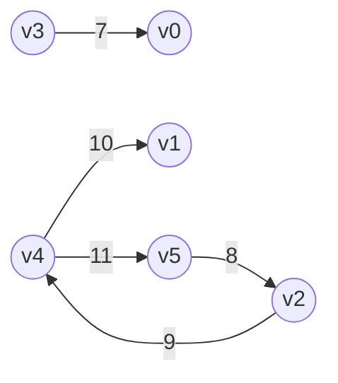

# enjoy algorithms

see [ALGORITHMS IN A NUTSHELL Second Edition](https://www.oreilly.com/library/view/algorithms-in-a/9781491912973/)

# sort

| name | example |
| :----- | :----- |
| insertion sort | exists |
| selection sort | exists |
| bubble sort | exists |
| heap sort | exists |
| quick sort | exists |
| bucket sort | exists |
| merge sort | exists |
| cocktail shaker sort | exists |
| shell sort | none |
| odd even sort | none |
| gnome sort | none |
| comb sort | none |
| circle sort | none |
| cycle sort | none |
| smooth sort | none |
| tournament sort | none |
| patience sort | none |
| unbalanced tree sort | none |
| counting sort | none |
| pigeonhole sort | none |
| gravity sort | none |
| american flag sort | none |
| radix sort | none |
| flash sort | none |
| shatter sort | none |
| time sort | none |
| bitonic sort | none |
| recursive pairwise sorting network | none |
| hybrid comb sort | none |
| tim sort | none |
| wiki sort | none |
| grail sort | none |
| sqrt sort | none |
| introspective sort[std::sort] | none |
| pancake sorting | none |
| bad sort | none |
| stooge sort | none |
| silly sort | none |
| slow sort | none |
| bogo sort | none |

## insertion sort

[source code](./erlang_code/sort/insertion_sort.erl)

<details><summary>sort logic</summary>

```erlang
sort(L) when 1 >= length(L) -> 
  L;
sort(L) ->
  sort(L, fun(A, B) -> compare(A, B) end).
sort(L, F) ->
  % when occured insertion then retry
  case sort(L, F, false) of
    {L1, true} -> sort(L1, F);
    {L1, false} -> L1
  end.
sort(L, F, Insertion) ->
  sort([], L, F, Insertion).
sort(Front, Rear, _, Insertion) when 1 >= length(Rear) ->
  {lists:append(Front, Rear), Insertion};
sort(Front, Rear, F, Insertion) ->
  [H1, H2 | T] = Rear,
  case F(H1, H2) of
    greater_than -> 
      insertion(H1, Front, [H2 | T], F);
    _ ->
      Front1 = lists:append(Front, [H1]),
      Rear1 = [H2 | T],
      sort(Front1, Rear1, F, Insertion)
  end.

-spec insertion(
  T, 
  list(T), 
  list(T), 
  fun((T, T) -> greater_than | equal_to | lower_than)) -> {list(T), true | false}.
insertion(Value, Front, Rear, _) when 0 >= length(Rear) ->
  {lists:append(Front, [Value]), true};
insertion(Value, Front, Rear, F) ->
  [H1 | T] = Rear,
  case F(Value, H1) of
    greater_than ->
      Front1 = lists:append(Front, [H1]),
      insertion(Value, Front1, T, F);
    _ ->
      Front1 = lists:append(Front, [Value]),
      L = lists:append(Front1, Rear),
      {L, true}
  end.
```

</details>

## selection sort

[source code](./erlang_code/sort/selection_sort.erl)

<details><summary>sort logic</summary>

```erlang
-spec sort(list(T)) -> list(T).
sort(L) when 1 >= length(L) ->
  L;
sort(L) ->
  sort(
    L, 
    fun(A, B) -> compare(A, B) end,
    length(L)).

-spec sort(
  list(T), 
  fun((T, T) -> greater_than | equal_to | lower_than),
  integer()) -> list(T).
sort(L, _, 0) ->
  L;
sort(L, F, N) ->
  {MaxValue, L1} = get_max_value(L, F, []),
  L2 = lists:append(L1, [MaxValue]),
  sort(L2, F, N-1).

-spec get_max_value(
  list(T),
  fun((T, T) -> greater_than | equal_to | lower_than),
  list(T)) -> {T, list(T)}.
get_max_value(L, _, Retain) when 1 >= length(L) ->
  [H1|_] = L,
  {H1, Retain};
get_max_value(L, F, Retain) ->
  [H1, H2|T] = L,
  case F(H1, H2) of
    greater_than ->
      Retain1 = lists:append(Retain, [H2]),
      L1 = [H1 | T],
      get_max_value(L1, F, Retain1);
    _ ->
      Retain1 = lists:append(Retain, [H1]),
      L1 = [H2 | T],
      get_max_value(L1, F, Retain1)
  end.
```

</details>

## bubble sort

[source code](./erlang_code/sort/bubble_sort.erl)

<details><summary>sort logic</summary>

```erlang
sort(L) ->
  sort(L, fun(A, B) -> compare(A, B) end).
sort(L, _) when 1 >= length(L) ->
  L;
sort(L, F) ->
  case sort(L, F, false) of
    {L2, true} -> sort(L2, F);
    {L2, false} -> L2
  end.
sort(L, _, Move) when 1 >= length(L) ->
  {L, Move};
sort(L, F, Move) ->
  [A, B | T] = L,
  case F(A, B) of
    greater_than ->
      {Rest, _} = sort([A|T], F, Move),
      {[B|Rest], true};
    _ ->
      {Rest, Move2} = sort([B|T], F, Move),
      {[A|Rest], Move2}
  end.

```

</details>

## heap sort

[source code](./erlang_code/sort/heap_sort.erl)

<details><summary>sort logic</summary>

```erlang
sort(L) when length(L) =< 0 ->
  [];
sort(L) ->
  F = fun(A, B) -> compare(A, B) end,
  L1 = build_heap(L, F),
  N = length(L1),
  sort(L1, F, N).
sort(L, _, I) when I =< 1 ->
  L;
sort(L, F, I) ->
  L1 = swap(L, 1, I),
  L2 = heap_sort(L1, F, 1, I),
  sort(L2, F, I - 1).

build_heap(L, F) ->
  N = length(L),
  I = trunc(N / 2),
  build_heap(L, F, I, N + 1).
build_heap(L, _, I, _) when I =< 0 -> L;
build_heap(L, F, I, N) ->
  L1 = heap_sort(L, F, I, N),
  build_heap(L1, F, I - 1, N).

-spec heap_sort(
  list(T),
  fun((T, T) -> greater_than | lower_than | equal_to),
  I, 
  I) -> list(T).
heap_sort(L, F, I, N) ->
  {LeftNodeIndex, RightNodeIndex} = get_child_index(I, N),
  RootNode = list_nth(I, L),
  LeftNode = list_nth(LeftNodeIndex, L),
  RightNode = list_nth(RightNodeIndex, L),
  case max_nodes(F, RootNode, LeftNode, RightNode) of
    right ->
      L1 = swap(L, I, RightNodeIndex),
      heap_sort(L1, F, RightNodeIndex, N);
    left ->
      L1 = swap(L, I, LeftNodeIndex),
      heap_sort(L1, F, LeftNodeIndex, N);
    _ ->
      L
  end.
```

</details>

## quick sort

[source code](./erlang_code/sort/quick_sort.erl)

<details><summary>sort logic</summary>

```erlang
-spec sort(list(T)) -> list(T).
sort(L) ->
  quick_sort(L).

-spec quick_sort(list(T)) -> list(T).
quick_sort([]) -> [];
quick_sort(L) when length(L) =:= 1 -> L;
quick_sort(L) when length(L) < 100 -> heap_sort:sort(L);
quick_sort(L) ->
  quick_sort(L, get_pivot_index(L)).
quick_sort(L, PivotIndex) when length(L) < PivotIndex ->
  heap_sort:sort(L);
quick_sort(L, PivotIndex) ->
  {L1, L2} = partition(L, PivotIndex),
  case L1 of
    L -> quick_sort(L, PivotIndex + 1);
    _ ->
      lists:append(
        quick_sort(L1),
        quick_sort(L2))
  end.
```

</details>

## bucket sort

[source code](./erlang_code/sort/bucket_sort.erl).

<details><summary>sort logic</summary>

```erlang
-spec sort(list(T)) -> list(T).
sort([]) -> [];
sort(L) ->
  sort(L, maps:new()).
sort([], Map) ->
  generate_list_from_map(Map, 1, [], maps:size(Map));
sort(L, Map) ->
  [#item{sort_value=Value}|T] = L,
  Map1 = case maps:is_key(Value, Map) of
    false ->
      maps:put(Value, [#item{sort_value=Value}], Map);
    true ->
      MapList = maps:get(Value, Map),
      RemovedMap = maps:remove(Value, Map),
      maps:put(Value, [#item{sort_value=Value} | MapList], RemovedMap)
  end,
  sort(T, Map1).

-spec generate_list_from_map(map(), integer(), list(T), integer()) -> list(T).
generate_list_from_map(_, _, L, Size) when Size =< 0 -> L;
generate_list_from_map(Map, I, L, _) ->
  {MapList, Map1} = case maps:is_key(I, Map) of
    true -> 
      List = maps:get(I, Map),
      RemovedMap = maps:remove(I, Map),
      {List, RemovedMap};
    false ->  {[], Map}
  end,
  L1 = lists:append(L, MapList),
  generate_list_from_map(Map1, I + 1, L1, maps:size(Map1)).
```

</details>

## merge sort

[source code](./erlang_code/sort/merge_sort.erl).

<details><summary>sort logic</summary>

```erlang
-spec sort(list(T)) -> list(T).
sort([]) -> [];
sort(L) when length(L) < 2 -> L;
sort(L) when length(L) =:= 2 -> 
  [Item1, Item2] = L,
  case compare(Item1, Item2) of
    greater_than -> swap(L, 1, 2);
    _ -> L
  end;
sort(L) ->
  SplitIndex = trunc(length(L) / 2),
  {L1, L2} = split_list(SplitIndex, L),
  SortedL1 = sort(L1),
  SortedL2 = sort(L2),
  merge(SortedL1, SortedL2).

-spec merge(list(T), list(T)) -> list(T).
merge(L1, L2) -> merge(L1, L2, []).
-spec merge(list(T), list(T), list(T)) -> list(T).
merge([], [], ResultList) -> ResultList;
merge(L1, [], ResultList) -> lists:append(ResultList, L1);
merge([], L2, ResultList) -> lists:append(ResultList, L2);
merge(L1, L2, ResultList) -> 
  [H1|T1] = L1,
  [H2|T2] = L2,
  case compare(H1, H2) of
    equal_to ->
      ResultList1 = lists:append(ResultList, [H1, H2]),
      merge(T1, T2, ResultList1);
    greater_than ->
      ResultList1 = lists:append(ResultList, [H2]),
      merge(L1, T2, ResultList1);
    lower_than ->
      ResultList1 = lists:append(ResultList, [H1]),
      merge(T1, L2, ResultList1)
  end.
```

</details>

## cocktail shaker sort


[source code](./erlang_code/sort/cocktail_shaker_sort.erl).

<details><summary>sort logic</summary>

```erlang
-spec sort(list(T)) -> list(T).
sort([]) -> [];
sort(L) ->
  sort(L, min, [], []).
sort([], _, Asc, Desc) ->
  lists:append(Asc, lists:reverse(Desc));
sort(L, Direction, Asc, Desc) ->
  case Direction of
    min ->
      {MinValue, L1} = choice_min_value(L),
      Asc1 = lists:append(Asc, [MinValue]),
      sort(L1, max, Asc1, Desc);
    max ->
      {MaxValue, L1} = choice_max_value(L),
      Desc1 = lists:append(Desc, [MaxValue]),
      sort(L1, min, Asc, Desc1)
  end.
```

</details>

# search

| name | example |
| :----- | :----- |
| sequential search | exists |
| binary search | exists |
| hash based search | exists |
| bloom filter | exists |
| binary search tree | exists |

## sequential search

[source code](./erlang_code/search/sequential_search.erl)

<details><summary>search logic</summary>

```erlang
-spec search(T, list(T)) -> T | not_found.
search(_, []) -> not_found;
search(Value, L) -> 
  [H|T] = L,
  case compare(Value, H) of
    equal_to -> H;
    _ -> search(Value, T)
  end.
```

</details>

## binary search

[source code](./erlang_code/search/binary_search.erl)

<details><summary>search logic</summary>

```erlang
-spec search(T, list(T)) -> T | not_found.
search(_, []) -> not_found;
search(Value, L) -> 
  search(Value, L, 1, length(L)).
search(_, _, Min, Max) when Min > Max -> not_found;
search(Value, L, Min, Max) -> 
  Index = trunc((Max + Min)  / 2),
  case compare(Value, lists:nth(Index, L)) of 
    equal_to -> Value;
    greater_than -> search(Value, L, Index + 1, Max);
    _ -> search(Value, L, Min, Index - 1)
  end.
```

</details>

## hash based search

[source code](./erlang_code/search/hash_based_search.erl)

<details><summary>search logic</summary>

```erlang
-spec search(T, list(T)) -> T | not_found.
search(_, []) -> not_found;
search(Value, L) -> 
  HashTable = create_hash_table(L),
  #item{value=SortValue} = Value,
  ValueHash = hash(SortValue),
  case maps:is_key(ValueHash, HashTable) of
    false -> not_found;
    true -> maps:get(ValueHash, HashTable)
  end.

-spec create_hash_table(list()) -> map().
create_hash_table(L) ->
  create_hash_table(L, maps:new()).
-spec create_hash_table(list(), map()) -> map().
create_hash_table([], Map) -> Map;
create_hash_table(L, Map) ->
  [H|T] = L,
  #item{value=SortValue} = H,
  Map1 = maps:put(hash(SortValue), H, Map),
  create_hash_table(T, Map1).
```

</details>

## bloom filter

see link

 + [Bloom filterの説明](http://dev.ariel-networks.com/column/tech/boom_filter/)
 + [Using Bloom Filters](https://www.perl.com/pub/2004/04/08/bloom_filters.html/)

[source code](./erlang_code/search/bloom_filter.erl)

<details><summary>search logic</summary>

```erlang
-spec search(T, list(T)) -> T | not_found.
search(_, []) -> not_found;
search(Value, L) -> 
  Mod = 1024,
  Filter = create_filter_table(L, Mod),
  ?OUTPUT_DEBUG(
     "filter: ~s", [[io_lib:format("~2.16.0B", [X]) || <<X:8>> <= Filter]]),
  filtered(Value, Filter, Mod).

-spec create_filter_table(list(), integer()) -> list().
create_filter_table(L, _) when length(L) =< 0 -> [];
create_filter_table(L, Mod) ->
  BitLength = convert_mod_to_bitlength(Mod),
  HashTable = <<0:BitLength>>,
  set_bit_to_filter_table(L, HashTable, Mod).
	
set_bit_to_filter_table([], HashTable, _) -> HashTable;
set_bit_to_filter_table(L, HashTable, Mod) ->
  BitLength = convert_mod_to_bitlength(Mod),
  [H|T] = L,
  HashValue = value_to_hash(H, Mod),
  HashTable1 = or_bit_string(HashTable, <<HashValue:BitLength>>),
  set_bit_to_filter_table(T, HashTable1, Mod).
```
</details>

## binary search tree

[source code](./erlang_code/search/binary_search_tree.erl)

<details><summary>search logic</summary>

```erlang
-spec search(T, list(T)) -> not_found | T.
search(_, []) -> not_found;
search(Value, L) ->
  ?OUTPUT_DEBUG("search/2: ~w", [start]),
  Tree = create_tree(L),
  ?OUTPUT_DEBUG("search/2: ~w", [create_tree_finish]),
  search_value(Value, Tree).

-spec search_value(T, list(T)) -> not_found | T.
search_value(Value, Tree) ->
  search_value(Value, Tree, 1).
search_value(_, Tree, Index) when length(Tree) < Index -> not_found;
search_value(Value, Tree, Index) ->
  [_, Node2Index, Node3Index] = get_node_indexes(Tree, Index),
  ?OUTPUT_DEBUG("search_value/3: comapre ~w, ~w", [Value, list_nth(Index, Tree)]),
  case compare(Value, list_nth(Index, Tree)) of
    greater_than ->
      search_value(Value, Tree, Node3Index);
    lower_than ->
      search_value(Value, Tree, Node2Index);
    equal_to -> Value
  end.
```
</details>

# Graph

vertex, edge, node, link, path, weight

 + undirected, unweighted graph
   + (u, v) = (v, u)
   + like a social network
 + directed graph
   + (u, v) /= (v, u)
 + weighted graph
   + weight(u, v)

ex) directed weighted graph.6 vertex, 5 edge.



data structure design

 + create
   + add vertex and edge
 + inspect
   + get graph infomation.directed or undirected.
   + get edge from vertex
   + get edge weight
 + update
   + add vertex, edge

## brute force

[source code](./erlang_code/graph/brute_force.erl)

<details><summary>search logic</summary>

```erlang
-spec search(list(T)) -> list(T).
search(L) ->
  % [[start, 1, 8, ..], [start, 2, 8, ...]]
  Routes = dfs_first_visit(start, L),
  FilteredRoutes = filter_route(Routes),
  show_routes(FilteredRoutes),
  ok.

dfs_first_visit(Route, L) ->
  Edges = get_vertex_edges(Route, L),
  dfs_first_visit(Route, L, Edges, []).
dfs_first_visit(_, _, [], Dist) -> Dist;
dfs_first_visit(Route, L, Edges, Dist) when is_list(Edges) ->
  [H|T] = Edges,
  % [[start, 1, 8, ...], [start, 1, 6, ...]]
  ResultRoute = dfs_visit([Route], H, L),
  Dist1 = lists:append(Dist, ResultRoute),
  % [[start, 1, 8, ...], [start, 1, 6, ...], [start, 2, 3, ...]]
  dfs_first_visit(Route, L, T, Dist1).

-spec dfs_visit(list(), integer() | stop | start, list()) -> list().
dfs_visit(Route, _, L) when length(Route) > length(L) -> Route;
dfs_visit(Route, Vertex, L) ->
  Route1 = lists:append(Route, [Vertex]),
  Edges = get_vertex_edges(Vertex, L),
  ExcludeVertexEdges = eliminate_vertex(Edges, Route),
  dfs_visit(Route1, ExcludeVertexEdges, L, []).

-spec dfs_visit(list(), list(), list(), list()) -> list().
dfs_visit(Route, [], _, Dist) -> 
  [Route | Dist];
dfs_visit(Route, Edges, L, Dist) ->
  [H|T] = Edges,
  ResultRoute = dfs_visit(Route, H, L),
  Dist1 = lists:append(Dist, ResultRoute),
  dfs_visit(Route, T, L, Dist1).
```

</details>

## depth first search

[source code](./erlang_code/graph/depth_first_search.erl)

<details><summary>search logic</summary>

```erlang
search(L) ->
  Route = dfs_visit(L, start),
  ?OUTPUT_DEBUG("create_route/2 - vertex: ~w", [Route]),
  show_routes(Route),
  ok.

-spec dfs_visit(list(T), integer() | start | stop) -> list(T).
dfs_visit(Nodes, TargetVertex) ->
  Nodes1 = set_node_status(Nodes, TargetVertex, gray),
  Edges = get_node_edges(Nodes, TargetVertex),
  Edges1 = choose_white_nodes(Nodes, Edges),
  dfs_visit(Nodes1, TargetVertex, Edges1).

-spec dfs_visit(list(T), integer() | start | stop, list(integer() | start | stop)) -> list(T).
dfs_visit(Nodes, TargetVertex, []) -> 
  set_node_status(Nodes, TargetVertex, black);
dfs_visit(Nodes, TargetVertex, Edges) ->
  [H|T] = Edges,
  Status = get_node_status(Nodes, H),
  ?OUTPUT_DEBUG("dfs_visit/3 - vertex: ~w, status; ~w", [H, Status]),
  Nodes1 = case Status of
    white ->
      set_node_period(Nodes, H, TargetVertex);
    _ -> Nodes
  end,
  Nodes2 = dfs_visit(Nodes1, H),
  dfs_visit(Nodes2, TargetVertex, T).

choose_white_nodes(_, []) -> [];
choose_white_nodes(Nodes, Edges) ->
  [H|T] = Edges,
  Targets = case get_node_status(Nodes, H) of
    white -> [H];
    _ -> []
  end,
  lists:append(Targets, choose_white_nodes(Nodes, T)).
```

</details>
