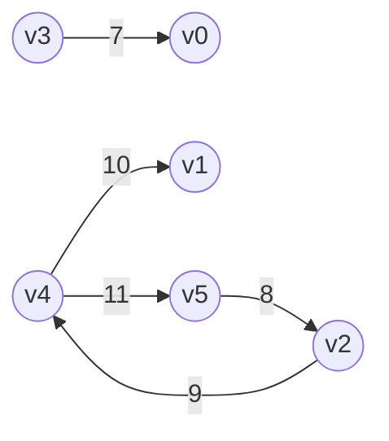

# Graph

vertex, edge, node, link, path, weight

 + undirected, unweighted graph
   + (u, v) = (v, u)
   + like a social network
 + directed graph
   + (u, v) /= (v, u)
 + weighted graph
   + weight(u, v)

ex) directed weighted graph.6 vertex, 5 edge.



data structure design

 + create
   + add vertex and edge
 + inspect
   + get graph infomation.directed or undirected.
   + get edge from vertex
   + get edge weight
 + update
   + add vertex, edge

## brute force

[source code](./erlang_code/graph/brute_force.erl)

<details><summary>search logic</summary>

```erlang
-spec search(list(T)) -> list(T).
search(L) ->
  % [[start, 1, 8, ..], [start, 2, 8, ...]]
  Routes = dfs_first_visit(start, L),
  FilteredRoutes = filter_route(Routes),
  show_routes(FilteredRoutes),
  ok.

dfs_first_visit(Route, L) ->
  Edges = get_vertex_edges(Route, L),
  dfs_first_visit(Route, L, Edges, []).
dfs_first_visit(_, _, [], Dist) -> Dist;
dfs_first_visit(Route, L, Edges, Dist) when is_list(Edges) ->
  [H|T] = Edges,
  % [[start, 1, 8, ...], [start, 1, 6, ...]]
  ResultRoute = dfs_visit([Route], H, L),
  Dist1 = lists:append(Dist, ResultRoute),
  % [[start, 1, 8, ...], [start, 1, 6, ...], [start, 2, 3, ...]]
  dfs_first_visit(Route, L, T, Dist1).

-spec dfs_visit(list(), integer() | stop | start, list()) -> list().
dfs_visit(Route, _, L) when length(Route) > length(L) -> Route;
dfs_visit(Route, Vertex, L) ->
  Route1 = lists:append(Route, [Vertex]),
  Edges = get_vertex_edges(Vertex, L),
  ExcludeVertexEdges = eliminate_vertex(Edges, Route),
  dfs_visit(Route1, ExcludeVertexEdges, L, []).

-spec dfs_visit(list(), list(), list(), list()) -> list().
dfs_visit(Route, [], _, Dist) -> 
  [Route | Dist];
dfs_visit(Route, Edges, L, Dist) ->
  [H|T] = Edges,
  ResultRoute = dfs_visit(Route, H, L),
  Dist1 = lists:append(Dist, ResultRoute),
  dfs_visit(Route, T, L, Dist1).
```

</details>

## depth first search

[source code](./erlang_code/graph/depth_first_search.erl)

<details><summary>search logic</summary>

```erlang
search(L) ->
  Route = dfs_visit(L, start),
  ?OUTPUT_DEBUG("create_route/2 - vertex: ~w", [Route]),
  show_routes(Route),
  ok.

-spec dfs_visit(list(T), integer() | start | stop) -> list(T).
dfs_visit(Nodes, TargetVertex) ->
  Nodes1 = set_node_status(Nodes, TargetVertex, gray),
  Edges = get_node_edges(Nodes, TargetVertex),
  Edges1 = choose_white_nodes(Nodes, Edges),
  dfs_visit(Nodes1, TargetVertex, Edges1).

-spec dfs_visit(list(T), integer() | start | stop, list(integer() | start | stop)) -> list(T).
dfs_visit(Nodes, TargetVertex, []) -> 
  set_node_status(Nodes, TargetVertex, black);
dfs_visit(Nodes, TargetVertex, Edges) ->
  [H|T] = Edges,
  Status = get_node_status(Nodes, H),
  ?OUTPUT_DEBUG("dfs_visit/3 - vertex: ~w, status; ~w", [H, Status]),
  Nodes1 = case Status of
    white ->
      set_node_period(Nodes, H, TargetVertex);
    _ -> Nodes
  end,
  Nodes2 = dfs_visit(Nodes1, H),
  dfs_visit(Nodes2, TargetVertex, T).

choose_white_nodes(_, []) -> [];
choose_white_nodes(Nodes, Edges) ->
  [H|T] = Edges,
  Targets = case get_node_status(Nodes, H) of
    white -> [H];
    _ -> []
  end,
  lists:append(Targets, choose_white_nodes(Nodes, T)).
```

</details>

## breadth first search

[source code](./erlang_code/graph/breadth_first_search.erl)

<details><summary>search logic</summary>

```erlang
search(L) ->
  Route = bfs_visit(L, start),
  show_routes(Route),
  ok.

bfs_visit(Nodes, Target) ->
  Queue = queue:new(),
  Queue1 = queue:in(Target, Queue),
  bfs_visit(Nodes, Target, Queue1).

bfs_visit(Nodes, Target, Queue) ->
  Node = queue:head(Queue),
  Edges = get_endges(Nodes, Node),
  {Nodes1, Queue1} = bfs_visit(Nodes, Node, Queue, Edges),
  case queue:len(Queue1) of
    0 ->  Nodes1;
    _  -> bfs_visit(Nodes1, Target, Queue1)
  end.

-spec bfs_visit(list(), integer() | stop | start, list(), list()) -> {list(), list()}.
bfs_visit(Nodes, Target, Queue, []) -> 
  {_, Queue1} = queue:out(Queue),
  Nodes1 = set_status(Nodes, Target, black),
  {Nodes1, Queue1};
bfs_visit(Nodes, Target, Queue, Edges) when is_list(Edges) ->
  [H|T]  = Edges,
  {Nodes1, Queue1} = bfs_visit(Nodes, Target, Queue, H),
  bfs_visit(Nodes1, Target, Queue1, T);
bfs_visit(Nodes, Target, Queue, Edge) ->
  case get_status(Nodes, Edge) of
    white ->
      Dist = get_dist(Nodes, Target),
      Nodes1 = set_dist(Nodes, Edge, Dist + 1),
      Nodes2 = set_period(Nodes1, Edge, Target),
      Nodes3 = set_status(Nodes2, Edge, gray),
      Queue1 = queue:in(Edge, Queue),
      {Nodes3, Queue1};
    _ -> 
      {Nodes, Queue}
  end.
```

</details>

## dijkstra's algorithm

[source code](./erlang_code/graph/dijkstra_algorithm.erl)

<details><summary>search logic</summary>

```erlang
search(L) ->
  Route = single_source_shortest(L, start),
  show_routes(Route),
  ok.

single_source_shortest(Nodes, StartVertex) -> 
  Nodes1 = set_dist(Nodes, StartVertex, 0),
  PQ = create_fist_priority_list(Nodes1),
  show_pq(PQ),
  {Nodes2, _} = calc_shortest_path(Nodes1, PQ),
  Nodes2.

calc_shortest_path(Nodes, []) -> {Nodes, []};
calc_shortest_path(Nodes, PQ) ->
  {Nodes1, PQ1} = case length(PQ) of
    0 -> {Nodes, PQ};
    _ ->
      {Vertex, RetainPQ} = get_min(PQ),
      ?OUTPUT_DEBUG("calc_shortest_path/2 - vertex: ~w", [Vertex]),
      Edges = get_edges(Nodes, Vertex),
      calc_shortest_path(Nodes, RetainPQ, Vertex, Edges)
  end,
  calc_shortest_path(Nodes1, PQ1).
calc_shortest_path(Nodes, PQ, _, [])  -> {Nodes, PQ};
calc_shortest_path(Nodes, PQ, MinVertex, Edges) ->
  [Edge|RetainEdges] = Edges,
  Weight = get_weight(Nodes, MinVertex, Edge#edge_record.vertex),
  MinVertexDist = get_dist(Nodes, MinVertex),
  EdgeDist = get_dist(Nodes, Edge#edge_record.vertex),
  Length = MinVertexDist + Weight,
  {Nodes1, PQ1} = case Length < EdgeDist of
    true ->
      DecreasePQ = decrease_priority(PQ, Edge#edge_record.vertex, Length),
      SetDistNodes = set_dist(Nodes, Edge#edge_record.vertex, Length),
      SetPeriodNodes = set_period(SetDistNodes, Edge#edge_record.vertex, MinVertex),
      {SetPeriodNodes, DecreasePQ};
    false -> {Nodes, PQ}
  end,
  calc_shortest_path(Nodes1, PQ1, MinVertex, RetainEdges).
```

</details>

## dijkstra's algorithm dense graph

[source code](./erlang_code/graph/dijkstra_algorithm_dense_graph.erl)

<details><summary>search logic</summary>

```erlang
search(Nodes) ->
    Nodes1 = set_dist(Nodes, start, 0),
    calc_shortest_path(Nodes1).

calc_shortest_path(Nodes) ->
    TargetNode = get_non_visit_min_vertex(Nodes),
    case TargetNode of
        null -> Nodes;
        _ -> calc_shortest_path(Nodes, TargetNode)
    end.

calc_shortest_path(Nodes, TargetNode) ->
    case TargetNode#vertex_record.dist of
        ?MAX_DIST -> Nodes;
        _ ->
            Nodes1 = set_visit(Nodes,
                               TargetNode#vertex_record.vertex,
                               true),
            ResultNodes = calc_shortest_path(Nodes1,
                                             TargetNode,
                                             TargetNode#vertex_record.edges),
            calc_shortest_path(ResultNodes)
    end.

calc_shortest_path(Nodes, _, []) -> Nodes;
calc_shortest_path(Nodes, TargetNode, Edges) ->
    [Edge | Retain] = Edges,
    Weight = get_weight(Nodes,
                        TargetNode#vertex_record.vertex,
                        Edge#edge_record.vertex),
    Length = TargetNode#vertex_record.dist + Weight,
    EdgeDist = get_dist(Nodes, Edge#edge_record.vertex),
    Nodes1 = case Length < EdgeDist of
                 true ->
                     SetDistNodes = set_dist(Nodes,
                                             Edge#edge_record.vertex,
                                             Length),
                     SetPeriodNodes = set_period(SetDistNodes,
                                                 Edge#edge_record.vertex,
                                                 TargetNode#vertex_record.vertex),
                     SetPeriodNodes;
                 _ -> Nodes
             end,
    calc_shortest_path(Nodes1, TargetNode, Retain).
```

</details>

## Bellman-Ford

[source code](./erlang_code/graph/bellman_ford.erl)

<details><summary>search logic</summary>

```erlang
-spec search(list()) -> list().

search([]) -> [];
search(Nodes) ->
    Nodes1 = set_dist(Nodes, start, 1),
    search(Nodes1, 1).

-spec search(list(), integer()) -> list().

search(Nodes, Count) when Count > length(Nodes) ->
    Nodes;
search(Nodes, Count) ->
    {Nodes1, Result} = single_source_shortest(Nodes,
                                              get_edge_records(Nodes),
                                              Count),
    case Result of
        true -> search(Nodes1, Count + 1);
        false -> []
    end.

-spec single_source_shortest(list(), list(),
                             integer()) -> {list(), true | false}.

single_source_shortest(Nodes, [], _) -> {Nodes, true};
single_source_shortest(Nodes, Edges, Count) ->
    [Edge | EdgeRetain] = Edges,
    ToDist = get_dist(Nodes, Edge#edge_record.to_vertex),
    NewCost = get_dist(Nodes, Edge#edge_record.from_vertex)
                  + Edge#edge_record.weight,
    {ChangedDistNodes, NegativeLoopBreak} =
        update_node_cost(Nodes, Edge, ToDist, NewCost, Count),
    ?OUTPUT_DEBUG("single_source_shortest/3 - nggative "
                  "loop: ~w",
                  [NegativeLoopBreak]),
    case NegativeLoopBreak of
        true -> {[], false};
        false ->
            single_source_shortest(ChangedDistNodes,
                                   EdgeRetain,
                                   Count)
    end.

-spec update_node_cost(list(), list(), integer(),
                       integer(), integer()) -> {list(), true | false}.

update_node_cost(Nodes, Edge, Cost, NewCost,
                 VertexCount)
    when Cost > NewCost ->
    ?OUTPUT_DEBUG("update_node_cost/5 - vertex: ~w, new "
                  "cost: ~w, vertex count: ~w",
                  [Edge#edge_record.to_vertex, NewCost, VertexCount]),
    SetDistNodes = set_dist(Nodes,
                            Edge#edge_record.to_vertex,
                            NewCost),
    SetPeriodNodes = set_period(SetDistNodes,
                                Edge#edge_record.to_vertex,
                                Edge#edge_record.from_vertex),
    NegativeLoopBreak = VertexCount >= length(Nodes),
    {SetPeriodNodes, NegativeLoopBreak};
update_node_cost(Nodes, _, _, _, _) -> {Nodes, false}.
```

</details>

## Floyd-Warshall

[source code](./erlang_code/graph/floyd_warshall.erl)

<details><summary>search logic</summary>

```erlang
-spec search(list()) -> list().

search([]) -> [];
search(Nodes) ->
    Dists = generate_first_dists(Nodes),
    calculate_cost(Nodes, Dists).

-spec calculate_cost([map()], [map()]) -> [map()].

calculate_cost([], _) -> [];
calculate_cost(_, []) -> [];
calculate_cost(Nodes, Dists) ->
    Vertexes = [Vertex
                || #vertex_record{vertex = Vertex} <- Nodes],
    calculate_cost(Dists, Vertexes, Vertexes, Vertexes).

calculate_cost(Dists, [], _, _) -> Dists;
calculate_cost(Dists, _, [], _) -> Dists;
calculate_cost(Dists, _, _, []) -> Dists;
calculate_cost(Dists, Vertexes1, Vertexes2, Vertexes3)
    when is_list(Vertexes1) and is_list(Vertexes2) and
             is_list(Vertexes3) ->
    [Vertex1 | Vertexes1Retain] = Vertexes1,
    NewDists = calculate_cost(Dists,
                              Vertex1,
                              Vertexes2,
                              Vertexes3),
    calculate_cost(NewDists,
                   Vertexes1Retain,
                   Vertexes2,
                   Vertexes3);
calculate_cost(Dists, Vertex1, Vertexes2, Vertexes3)
    when not is_list(Vertex1) and is_list(Vertexes2) and
             is_list(Vertexes3) ->
    [Vertex2 | Vertexes2Retain] = Vertexes2,
    NewDists = calculate_cost(Dists,
                              Vertex1,
                              Vertex2,
                              Vertexes3),
    calculate_cost(NewDists,
                   Vertex1,
                   Vertexes2Retain,
                   Vertexes3);
calculate_cost(Dists, Vertex1, Vertex2, Vertexes3)
    when not is_list(Vertex1) and not is_list(Vertex2) and
             is_list(Vertexes3) ->
    [Vertex3 | Vertexes3Retain] = Vertexes3,
    NewDists = calculate_cost(Dists,
                              Vertex1,
                              Vertex2,
                              Vertex3),
    calculate_cost(NewDists,
                   Vertex1,
                   Vertex2,
                   Vertexes3Retain);
calculate_cost(Dists, Vertex1, Vertex2, Vertex3)
    when not is_list(Vertex1) and not is_list(Vertex2) and
             not is_list(Vertex3) ->
    Dist1 = get_dist(Dists, Vertex2, Vertex1),
    Dist2 = get_dist(Dists, Vertex1, Vertex3),
    Dist3 = get_dist(Dists, Vertex2, Vertex3),
    NewLen = Dist1#dist_record.cost +
                 Dist2#dist_record.cost,
    case NewLen < Dist3#dist_record.cost of
        true ->
            set_dist_and_period(Dists,
                                Vertex2,
                                Vertex3,
                                NewLen,
                                Dist2#dist_record.period);
        false -> Dists
    end.
```

</details>

## Prim's algorithm

[source code](./erlang_code/graph/prims_algorithm.erl)

<details><summary>search logic</summary>

```erlang
spec search(list()) -> list().

search(Nodes) ->
    Keys = generate_initial_keys(Nodes),
    Periods = generate_initial_periods(Nodes),
    SetStartKeys = maps:put(0, 0, Keys),
    PriorityQueue = generate_priority_queue(Nodes,
                                            SetStartKeys),
    {_, _, Routes} = create_paths(Nodes,
                                  PriorityQueue,
                                  SetStartKeys,
                                  Periods),
    Routes.

create_paths(_, [], Keys, Periods) ->
    {[], Keys, Periods};
create_paths(Nodes, PQ, Keys, Periods)
    when is_list(Nodes) ->
    {PriorityRec, PopdPQ} = get_min(PQ),
    Node =
        lists:keyfind(PriorityRec#priority_queue_record.vertex,
                      #vertex_record.vertex,
                      Nodes),
    {NewPQ, NewKeys, NewPeriods} = create_paths(Node,
                                                PopdPQ,
                                                Keys,
                                                Periods),
    create_paths(Nodes, NewPQ, NewKeys, NewPeriods);
create_paths(Node, PQ, Keys, Periods) ->
    create_paths(Node,
                 Node#vertex_record.edges,
                 PQ,
                 Keys,
                 Periods).

create_paths(_, [], PQ, Keys, Periods) ->
    {PQ, Keys, Periods};
create_paths(Node, Edges, PQ, Keys, Periods)
    when is_list(Edges) ->
    [Edge | EdgeRetain] = Edges,
    {NewPQ, NewKeys, NewPeirods} = case
                                       exists_vertex_in_priority_queue(PQ,
                                                                       Edge#edge_record.to_vertex)
                                       of
                                       true ->
                                           calculate_cost(Node,
                                                          Edge,
                                                          PQ,
                                                          Keys,
                                                          Periods);
                                       false -> {PQ, Keys, Periods}
                                   end,
    create_paths(Node,
                 EdgeRetain,
                 NewPQ,
                 NewKeys,
                 NewPeirods).

calculate_cost(Node, Edge, PQ, Keys, Periods) ->
    EdgeCost = Edge#edge_record.cost,
    CurrentCost = maps:get(Edge#edge_record.to_vertex,
                           Keys),
    case EdgeCost < CurrentCost of
        true ->
            NewPeriods = maps:put(Edge#edge_record.to_vertex,
                                  Node#vertex_record.vertex,
                                  Periods),
            NewKeys = maps:put(Edge#edge_record.to_vertex,
                               EdgeCost,
                               Keys),
            NewPQ = decrease_priority(PQ,
                                      Edge#edge_record.to_vertex,
                                      EdgeCost),
            {NewPQ, NewKeys, NewPeriods};
        false -> {PQ, Keys, Periods}
    end.
```

</details>