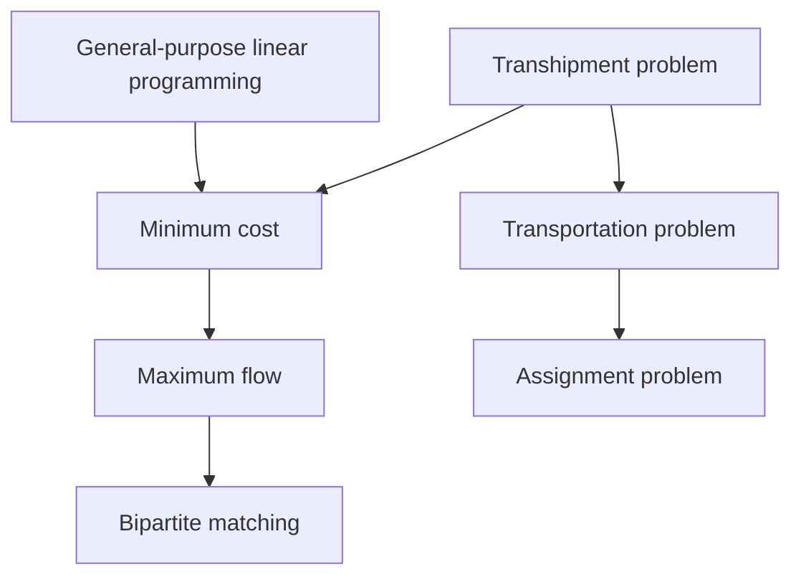
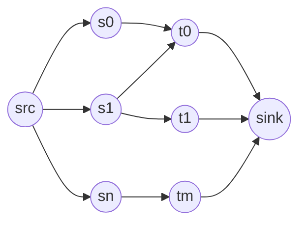
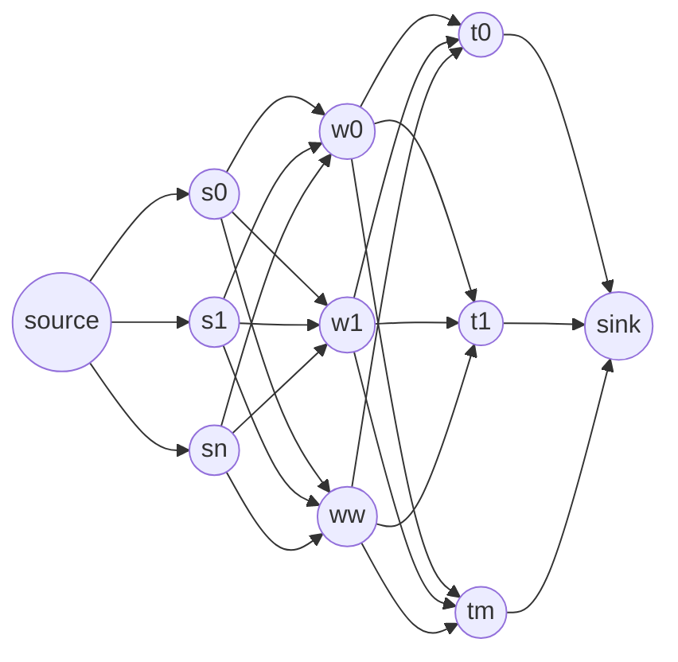

# Nework flow algorithm



graph structure

```math
graph = G = (V,E) \\
vertexes = V \\
edges = E \\
s = source \\
s \in V \\
t = sink \\
t \in V \\
e(u, v) = edge \\
f(u, v) = flow cost \\
c(u, v) = capacity \\
```

flow constraint

```math
f(u, v) \geqq 0 \\
f(u, v) \leqq c(u, v) 
```

cost constraint

```math
e(u, v)  \notin E \\
\rightarrow c(u, v) = 0
```

flow save

```math
s \notin v, u, w \\
t \notin v, u, w \\
\sum f(v, u) = \sum f(u, w)
```

skew symmetry

```math
f(u, v) = f(v, u) * -1
```

## Ford-Fullkerson

maximum flow.

```math
path = (p_0, ..., p_{n-1}) \\
p_0 = s \\
p_{n-1} = t \\
```

forward edge

```math
e(p_i, p_{i+1}) \in E 
```

backward edge

```math
e(p_{i+1}, p_i) \in E
```

[source code](./erlang_code/netowrk_flow/ford_fullkerson.erl)

<details><summary>compute logic</summary><div>

```erlang
-spec generate_argumenting_path(list(edge_record)) -> list(argumenting_path_record).
generate_argumenting_path(Graph) ->
  Queue = [source],
  ArgPaths = [
    #argumenting_path_record{
      vertex=source,
      previous=null,
      direction=none}],
  generate_argumenting_path(Graph, Queue, ArgPaths).

-spec generate_argumenting_path(
    list(edge_record), 
    list(atom()), 
    list(argumenting_path_record)
  ) -> list(argumenting_path_record).
generate_argumenting_path(_, [], _) -> 
  [];
generate_argumenting_path(Edges, PathQueue, ArgPaths) -> 
  {Vertex, PathQueueRetain} = pop_vertex_queue(PathQueue),
  {ExistsArgumentingPath, PathQueue2, ArgPaths2} = 
    generate_argumenting_path_forward(Edges, PathQueueRetain, ArgPaths, Vertex),
  case ExistsArgumentingPath of
    true -> 
      ArgPaths2;
    false -> 
      {PathQueue3, ArgPaths3} = 
        generate_argumenting_path_backward(
          Edges, 
          PathQueue2, 
          ArgPaths2, 
          Vertex),
      generate_argumenting_path(Edges, PathQueue3, ArgPaths3)
  end.

-spec process_path(list(edge_record), list(argumenting_path_record)) -> list(edge_record).
process_path(Edges, ArgPaths) ->
  Vertex = sink,
  Delta = calculate_delta(Edges, ArgPaths, Vertex, ?MAX_DELTA),
  ?OUTPUT_DEBUG(
    "process_path/2 - delta: ~w",
    [Delta]),
  reflect_delta(Edges, ArgPaths, Delta).

-spec calculate_delta(
    list(edge_record), 
    list(argumenting_path_record),
    atom(),
    integer()
  ) -> integer().
calculate_delta(_, _, source, Delta) -> Delta;
calculate_delta(Edges, ArgPaths, Vertex, Delta) ->
  ?OUTPUT_DEBUG(
    "calculate_delta/4 - vertex: ~w",
    [Vertex]),
  ArgPath = find_argumenting_path(Vertex, ArgPaths),
  {TryDelta, NextVertex}  = case ArgPath#argumenting_path_record.direction of
    forward ->
      ?OUTPUT_DEBUG(
        "calculate_delta/4 - forward(vertex: ~w, previous: ~w)",
        [
          ArgPath#argumenting_path_record.vertex,
          ArgPath#argumenting_path_record.previous
        ]),
      Edge = find_edge(
        ArgPath#argumenting_path_record.previous,
        ArgPath#argumenting_path_record.vertex,
        Edges),
      {
        Edge#edge_record.capacity - Edge#edge_record.flow, 
        Edge#edge_record.from
      };
    backward ->
      ?OUTPUT_DEBUG(
        "calculate_delta/4 - backward(vertex: ~w, previous: ~w)",
        [
          ArgPath#argumenting_path_record.vertex,
          ArgPath#argumenting_path_record.previous
        ]),
      Edge = find_edge(
        ArgPath#argumenting_path_record.vertex,
        ArgPath#argumenting_path_record.previous,
        Edges),
      {
        Edge#edge_record.flow,
        Edge#edge_record.to
      }
  end,
  NewDelta = erlang:min(Delta, TryDelta),
  ?OUTPUT_DEBUG(
    "calculate_delta/4 - delta ~w , try delta: ~w",
    [Delta, TryDelta]),
  calculate_delta(Edges, ArgPaths, NextVertex, NewDelta).

-spec reflect_delta(
    list(edge_record), 
    list(argumenting_path_record), 
    integer()
  ) -> list(edge_record).
reflect_delta(Edges, ArgPaths, Delta) ->
  Vertex = sink,
  reflect_delta(Edges, ArgPaths, Delta, Vertex).

-spec reflect_delta(
    list(edge_record), 
    list(argumenting_path_record), 
    integer(),
    atom() 
  ) -> list(edge_record).
reflect_delta(Edges, _, _, source) -> Edges;
reflect_delta(Edges, ArgPaths, Delta, Vertex) -> 
  ?OUTPUT_DEBUG(
     "reflect_delta/4 - edge length: ~w",
     [length(Edges)]),
  ?OUTPUT_DEBUG(
     "reflect_delta/4 - vertex: ~w in ~w",
     [Vertex, ArgPaths]),
  ArgPath = find_argumenting_path(Vertex, ArgPaths),

  ?OUTPUT_DEBUG(
     "reflect_delta/4 - founded arg path: ~w",
     [ArgPath]),

  {Edges2, NextVertex} = case ArgPath#argumenting_path_record.direction of
    forward ->
      NewEdge = add_flow(
        Edges, 
        ArgPath#argumenting_path_record.previous, 
        Vertex, 
        Delta),
      {NewEdge, ArgPath#argumenting_path_record.previous};
    backward ->
      NewEdge = sub_flow(
        Edges, 
        Vertex,
        ArgPath#argumenting_path_record.previous,
        Delta),
      {NewEdge, ArgPath#argumenting_path_record.previous}
  end,
  reflect_delta(Edges2, ArgPaths, Delta, NextVertex).
```

</div></details>


## Ford-Fullkerson / breadth first

stack to queue

[source code](./erlang_code/netowrk_flow/ford_fullkerson_with_breadth_first.erl)

<details><summary>compute logic</summary><div>

```erlang
-spec generate_argumenting_path(list(edge_record)) -> list(argumenting_path_record).
generate_argumenting_path(Graph) ->
  Queue = [source],
  ArgPaths = [
    #argumenting_path_record{
      vertex=source,
      previous=null,
      direction=none}],
  generate_argumenting_path(Graph, Queue, ArgPaths).

-spec generate_argumenting_path(
    list(edge_record), 
    list(atom()), 
    list(argumenting_path_record)
  ) -> list(argumenting_path_record).
generate_argumenting_path(_, [], _) -> 
  [];
generate_argumenting_path(Edges, PathQueue, ArgPaths) -> 
  {Vertex, PathQueueRetain} = remove_first_vertex_queue(PathQueue),
  {ExistsArgumentingPath, PathQueue2, ArgPaths2} = 
    generate_argumenting_path_forward(Edges, PathQueueRetain, ArgPaths, Vertex),
  case ExistsArgumentingPath of
    true -> 
      ArgPaths2;
    false -> 
      {PathQueue3, ArgPaths3} = 
        generate_argumenting_path_backward(
          Edges, 
          PathQueue2, 
          ArgPaths2, 
          Vertex),
      generate_argumenting_path(Edges, PathQueue3, ArgPaths3)
  end.

-spec generate_argumenting_path_forward(
    list(edge_record),
    list(atom()), 
    list(argumenting_path_record),
    atom()) ->  
  {
    true | false,
    list(atom()), 
    list(argumenting_path_record)
  }.
generate_argumenting_path_forward(Edges, PathQueue, ArgPaths, Vertex) ->
  ForwardEdges = find_edge_forward(Vertex, Edges),
  generate_argumenting_path_forward(Edges, PathQueue, ArgPaths, Vertex, ForwardEdges).

-spec generate_argumenting_path_forward(
    list(edge_record),
    list(atom()), 
    list(argumenting_path_record),
    atom(),
    list(edge_record)) -> 
  {
    true | false,
    list(atom()), 
    list(argumenting_path_record)
  }.
generate_argumenting_path_forward(_, PathQueue, ArgPaths, _, []) -> 
  {false, PathQueue, ArgPaths};
generate_argumenting_path_forward(Edges, PathQueue, ArgPaths, Vertex, ForwardEdges) -> 
  [ForwardEdge | ForwardEdgesRetain] = ForwardEdges,
  Exists = exists_argumenting_path(
    ForwardEdge#edge_record.to, 
    ArgPaths),
  FullTank = (ForwardEdge#edge_record.capacity > ForwardEdge#edge_record.flow),
  ArrivalSink = (ForwardEdge#edge_record.to  ==  sink),
  ?OUTPUT_DEBUG(
     "generate_argumenting_path_forward/5 - ~w in arg path exists: ~w, full tank: ~w, arrival sink: ~w",
    [ForwardEdge#edge_record.to, Exists, FullTank , ArrivalSink ]),
  {Return, PathQueue2, ArgPaths2} = case {Exists, FullTank, ArrivalSink} of
    % not arrival,not limit and not arrival sink
    {false, true, false} -> 
      ?OUTPUT_DEBUG("generate_argumenting_path_forward - ~w", [not_arrival_sink]),
      NewArgPaths = add_argumenting_path(
        ForwardEdge#edge_record.to, 
        Vertex, 
        forward, 
        ArgPaths),
      NewPathQueue = insert_vertex_queue(
        ForwardEdge#edge_record.to, 
        PathQueue),
      {false, NewPathQueue, NewArgPaths};
    % not arrival,not limit and arrival sink
    {false, true, true} ->
      ?OUTPUT_DEBUG("generate_argumenting_path_forward - ~w", [arrival_sink]),
      NewArgPaths = add_argumenting_path(
        ForwardEdge#edge_record.to, 
        Vertex, 
        forward, 
        ArgPaths),
      {true, PathQueue, NewArgPaths};
    _ -> 
      ?OUTPUT_DEBUG("generate_argumenting_path_forward - ~w", [any]),
      {false, PathQueue, ArgPaths}
  end,
  case Return of
    true ->
      {true, PathQueue2, ArgPaths2};
    false ->
      generate_argumenting_path_forward(
        Edges, 
        PathQueue2, 
        ArgPaths2, 
        Vertex, 
        ForwardEdgesRetain)
  end.

-spec generate_argumenting_path_backward(
    list(edge_record),
    list(atom()),
    list(argumenting_path_record),
    atom() 
  ) -> {list(atom()), list(argumenting_path_record)}.
generate_argumenting_path_backward(Edges, PathQueue, ArgPaths, Vertex) ->
  ?OUTPUT_DEBUG(
    "generate_argumenting_path_backward/4 - vertex: ~w",
    [Vertex]),
  BackwardEdges = find_edge_backward(Vertex, Edges),
  ?OUTPUT_DEBUG(
    "generate_argumenting_path_backward/4 - edges: ~w",
    [BackwardEdges]),
  generate_argumenting_path_backward(Edges, PathQueue, ArgPaths, Vertex, BackwardEdges).

-spec generate_argumenting_path_backward(
    list(edge_record),
    list(atom()),
    list(argumenting_path_record),
    atom(),
    list(edge_record)
  ) -> {list(atom()), list(argumenting_path_record)}.
generate_argumenting_path_backward(_, PathQueue, ArgPaths, _, []) ->
  {PathQueue, ArgPaths};
generate_argumenting_path_backward(Edges, PathQueue, ArgPaths, Vertex, BackwardEdges) ->
  [BackwardEdge | BackwardEdgesRetain] = BackwardEdges,
  ExistsArgPath = exists_argumenting_path(
    BackwardEdge#edge_record.from,
    ArgPaths),
  ExistsFlow = BackwardEdge#edge_record.flow > 0,
  ?OUTPUT_DEBUG(
    "generate_argumenting_path_backward/5 - exists arg path: ~w, exists flow: ~w",
    [ExistsArgPath, ExistsFlow]),
  {PathQueue2, ArgPaths2} = case {ExistsArgPath, ExistsFlow} of
    % not arrival and exists flow
    {false, true} ->
      NewArgPaths = add_argumenting_path(
        BackwardEdge#edge_record.from,
        Vertex,
        backward,
        ArgPaths),
      NewPathQueue = insert_vertex_queue(
        Vertex, 
        PathQueue),
      {NewPathQueue, NewArgPaths};
    _ ->
      {PathQueue, ArgPaths}
  end,
  generate_argumenting_path_backward(
    Edges, 
    PathQueue2, 
    ArgPaths2, 
    Vertex, 
    BackwardEdgesRetain).

%%%%%%%%%%%%%%%%%%%%%%%%%%%%%%%%%%%%%%%%%%%%%%%%%%
% Vertex Queue functions
-spec insert_vertex_queue(atom(), list(atom())) -> 
  list(atom()).
insert_vertex_queue(Vertex, Queue) ->
  [Vertex] ++ Queue.

-spec remove_first_vertex_queue(list(atom())) -> 
  {atom(), list(atom())}.
remove_first_vertex_queue(Queue) ->
  [Head | Retain] = Queue,
  {Head, Retain}.
```

</div></details>

## Biporate matching

think of biporate matching problem as the maximum flow problem.

ex) matching jobs with qualified people.

```math
jobs = s_{i} \in S \\
peoples = t_{j} \in J \\
skils = p_{k} \in P \\
p_{k} = (s_{i}, t_{j}) \\
```

think graph structure.convert jobs and peoples to vertexes.

```math
source = V[-1] \\
S = V[0, n -1] \\
T = V[n, n + m] \\
sink = V[n + m + 1]
```

convert skils to edges between S and T.edge capacity is 1 const.



[source code](./erlang_code/network_flow/biporate_matching.erl)

<details><summary>convert logic</summary><div>

```erlang
generate_initial_graph(TestCase) ->
  Jobs=generate_initial_jobs(TestCase),
  Peoples=generate_initial_peoples(TestCase),
  Edges = generate_graph_edges(Jobs, Peoples),
  ShapedEdges = remove_duplicate_edge(Edges),
  show_result(ShapedEdges),
  ShapedEdges.

-spec generate_graph_edges(
    list(job_record),
    list(people_record)
  ) -> list(edge_record).
generate_graph_edges([], _) -> [];
generate_graph_edges(Jobs, Peoples) ->
  [Job | JobsRetain] = Jobs,
  Edges = generate_graph_edges_per_job(Job, Peoples),
  Edges ++ generate_graph_edges(JobsRetain, Peoples).

-spec generate_graph_edges_per_job(
    job_record,
    list(people_record)
  ) -> list(edge_record).
generate_graph_edges_per_job(_, []) -> [];
generate_graph_edges_per_job(Job, Peoples) ->
  [People | PeoplesRetain] = Peoples,
  Edge = case match_job_and_people(Job, People) of
    true ->
      [
        #edge_record{
           from=source,
           to=Job#job_record.name,
           flow=0,
           capacity=1
        },
        #edge_record{
           from=Job#job_record.name,
           to=People#people_record.name,
           flow=0,
           capacity=1
        },
        #edge_record{
           from=People#people_record.name,
           to=sink,
           flow=0,
           capacity=1
        }
      ];
    false -> []
  end,
  Edge ++ generate_graph_edges_per_job(Job, PeoplesRetain).

-spec remove_duplicate_edge(list(edge_record)) -> list(edge_record).
remove_duplicate_edge([]) -> [];
remove_duplicate_edge(Edges) ->
  [Edge | Retain] = Edges,
  case find_edge(
        Edge#edge_record.from,
        Edge#edge_record.to,
        Retain) of
    null -> [Edge];
    _ -> []
  end ++ remove_duplicate_edge(Retain).

-spec match_job_and_people(job_record, people_record) -> true | false.
match_job_and_people(Job, People) ->
  NeedSkills = Job#job_record.need_skills,
  HasSkills = People#people_record.skills,
  in_skills(NeedSkills, HasSkills).

in_skills([], _) -> true;
in_skills(NeedSkills, HasSkills) ->
  [NeedSkill | NeedSkillsRetain] =  NeedSkills,
  case lists:any(fun(Skill) -> NeedSkill == Skill end, HasSkills) of
    false -> false;
    true -> 
      in_skills(NeedSkillsRetain, HasSkills)
  end.
```

</div></details>


## minimum cost

add cost to ford-fullkerson.

```math
cost = d(u, v)
```

purpose is miinmum cost

```math
\sum(f(u, v)d(u, v))
```

[source code](./erlang_code/network_flow/minimum_cost.erl)

<details><summary>logic</summary><div>

```erlang
-spec generate_argumenting_path(
      list(edge),
    list(priority_queue_record),
    map(),
    list(argumenting_record),
    atom(),
    list(atom())
  ) -> list(argumenting_record).
generate_argumenting_path(Edges, PriorityQueue, Dists, ArgPaths, _, []) ->
  generate_argumenting_path( Edges, PriorityQueue, Dists, ArgPaths);
generate_argumenting_path(Edges, PriorityQueue, Dists, 
    ArgPaths, CurrentVertex, Vertexes) ->
  [NextVertex | VertexesRetain] = Vertexes,

  ?OUTPUT_DEBUG("generate_argumenting_path/6 - next vertex: ~w", [NextVertex]),
  % forward
  {PriorityQueue2, 
    Dists2, 
    ArgPaths2} = 
    generate_argumenting_path_forward(Edges, PriorityQueue, Dists, 
      ArgPaths, CurrentVertex,NextVertex),
  ?OUTPUT_DEBUG("generate_argumenting_path/6 - ~w", [after_forward]),
  show_dists(Dists2),
  % backward
  {PriorityQueue3, 
  Dists3, 
  ArgPaths3} = 
    generate_argumenting_path_backward(Edges, PriorityQueue2, Dists2, 
      ArgPaths2, CurrentVertex, NextVertex),
  ?OUTPUT_DEBUG("generate_argumenting_path/6 - ~w", [after_backward]),
  show_dists(Dists3),
  generate_argumenting_path(Edges, PriorityQueue3, Dists3, 
    ArgPaths3,CurrentVertex,VertexesRetain).

-spec generate_argumenting_path_forward(
    list(edge),
    list(priority_queue_record),
    map(),
    list(argpath),
    atom(),
    atom()
  ) ->  {
        list(priority_queue_record),
        map(),
        list(argpath)}.
generate_argumenting_path_forward(
      Edges, PriorityQueue, Dists, 
      ArgPaths, CurrentVertex, NextVertex) ->
  Edge = find_edge(CurrentVertex, NextVertex, Edges),
  {ExistsEdge, NewDist, NotFull} = case Edge of
      null -> 
        {false, -1, false};
      _ -> 
        {
          true,
          maps:get(CurrentVertex, Dists) + Edge#edge.cost, 
          (Edge#edge.flow < Edge#edge.capacity)
        }
    end,
  NextDist = maps:get(NextVertex, Dists),
  UpdateDist = (NewDist >= 0) and (NewDist < NextDist),
  case {ExistsEdge, NotFull, UpdateDist} of
    {true, true, true} ->
      % new argumenting path
      NewArgPaths = add_argumenting_path(NextVertex, CurrentVertex,forward, ArgPaths),
      % new dists
      NewDists = maps:put(NextVertex, NewDist, Dists),
      % new priority queue
      NewPriorityQueue = insert_priority_queue(NextVertex, NewDist, PriorityQueue),
      {
        NewPriorityQueue,
        NewDists,
        NewArgPaths
      };
    _ ->
      % no change
      {
        PriorityQueue, 
        Dists, 
        ArgPaths
      }
  end.
  
-spec generate_argumenting_path_backward(
    list(edge),
    list(priority_queue_record),
    map(),
    list(argpath),
    atom(),
    atom()
  ) ->  {
        list(priority_queue_record),
        map(),
        list(inqueue_record),
        list(argpath)}.
generate_argumenting_path_backward(
      Edges, PriorityQueue, Dists, 
      ArgPaths, CurrentVertex, NextVertex) ->
  Edge = find_edge(NextVertex, CurrentVertex, Edges),
  {ExistsEdge, NewDist, NonEmpty} = case Edge of
      null -> {false, -1, false};
      _ ->
        {
          true, 
          maps:get(CurrentVertex, Dists) - Edge#edge.cost, 
          (Edge#edge.flow > 0)
        }
    end,
  UpdateDist = (NewDist >= 0) and (NewDist < maps:get(NextVertex, Dists)),
  case {ExistsEdge, NonEmpty, UpdateDist} of
    {true, true, true} ->
      % new argmenting path
      NewArgPaths = add_argumenting_path(NextVertex, CurrentVertex, backward, ArgPaths),
      % new dists
      NewDists = maps:put(NextVertex, NewDist, Dists),
      % new primary queue
      NewPriorityQueue = insert_priority_queue(NextVertex, NewDist, PriorityQueue),
      {
        NewPriorityQueue,
        NewDists,
        NewArgPaths
      };
    _ ->
      {
        PriorityQueue,
        Dists,
        ArgPaths
      }
  end.
```

</div></details>


## Transhipment problem

problem description

supplyer

```math
Supplyer = S \\
s_{i} \in S \\
S = [s_{0}, ..., s_{m}] \\
sup(s_{i}) = supply\ unit\ count
```

demand

```math
Demand = T \\
t_{j} \in T \\
T = [t_{0}, ..., t_{n}] \\
dem(t_{j}) = demand\ unit\ count
```

warehouse

```math
Warehouse = W \\
w_{k} \in W \\
W = [w_{0}, ..., w_{w}] \\
max(w_{k}) = acceptable\ unit\ count \\
exchange(w_{k}) = exhange\ cost\ par\ unit
```

graph

```math
f(i, j) = flow\ unit\ count \\
d(i, j) = source\ to\ sink\ shipment\ cost\ par\ unit\\
ts(i, j) = transport\ cost\ par\ unit
```

constraint

+ warehouse netflow is 0
+ units are not lost 
+ units do not increase
+ \(sup(s_{i}) > 0\)
+ \(dem(t_{j}) > 0\)
+ \(d(i, ) > 0\)
+ \(ts(i, ) > 0\)

purpose

```text
Find f () with the lowest overall cost
```

lowest overall cost

```math
Total\ Cost = Transport\ Cost + Exchange\ Cost\\
Transport\ Cost = \sum_{i}\sum_{j}d(i, j)f(i, j)\\
Exchange\ Cost = \sum_{i}\sum_{k}ts(i, k)f(i, k) + \\
  \sum_{j}\sum_{k}ts(j, k)f(j, k) + \\
  \sum_{k}\sum_{j}exhange(k)*f(j, k) + \\
  \sum_{k}\sum_{i}exhange(k)*f(i, k)
```

transhipment problem convert to minimum cost problem.

```math
G = (V, E) \\
V = [v_{0}, ..., v_{n + m + 2w + 2}]\\
E = [e_{0}, ..., e_{(w+1)(m+n) + (nm) + w}]
```

vertex mapping

```math
s_{i} = v_{i}\\
w_{k} = [v_{m + 2k - 1}, v_{m + 2k}]\\
t_{j} = v_{1 + m + 2w + j}\\
source = -1\\
sink = v_{n + m + 2w + 1}
```

edge mapping

| from | to | count | cost | capacity |
| :----- | :----- | :----- | :----- | :----- |
| source | supplyer | suppyer | 0 | \(sup(i)\) |
| supplyer | demand | supplyer * demand | \(d(i, j)\) | infine |
| supplyer | warehouse | supper * warehouse | \(ts(i, k)\) | \(sup(i)\) |
| warehouse | warehouse | warehouse | \(exchange(k)\) | \(max(k)\) |
| warehouse | demand | warehouse * demand | \(ts(k, j)\) | \(dem(j)\) |
| demand | sink | demand | 0 | \(dem(j)\) |



[source code](./erlang_code/network_flow/transhipment.erl)

<details><summary>logic</summary><div>

```erlang
generate_graph(TestCase) ->
    Supplyers = generate_supplyers(TestCase),
    Demands = generate_demands(TestCase),
    Warehouses = generate_warehouses(TestCase),
    generate_edges(Supplyers, Demands, Warehouses).

-spec generate_supplyers(integer()) -> list(supplyer).
generate_supplyers(1) ->
    [
        #supplyer{
            no=1,
            supply_unit_count=60, 
            transport_cost_par_warehouse=[{1,114}],
            costs_for_demand=[{1, 528}]}
    ].

-spec generate_demands(integer()) -> list(demand).
generate_demands(1) ->
    [
        #demand{no=1, demand_unit_count=40}
    ].

-spec generate_warehouses(integer()) -> list(warehouse).
generate_warehouses(1) ->
    [
        #warehouse{no=1, cost_par_unit=7, capacity=9999, costs_for_demand=[{1, 7}]}
    ].

-spec generate_edges(
    list(supplyer),
    list(demand),
    list(warehouse)) -> list(edge).
generate_edges(Supplyers, Demands, Warehouses) ->
    generate_supplyer_edges(Supplyers, Demands, Warehouses)
     ++ generate_warehouse_edges(Warehouses, Demands)
     ++ generate_demands_edges(Demands).

generate_supplyer_edges(Supplyers, Demands, Warehouses) ->
    SourceEdges = generate_source_to_supplyer_edges(Supplyers),
    AddWarehouseEdges = SourceEdges ++ 
        generate_supplyer_to_warehouse_edges(Supplyers, Warehouses),
    AddDemandEdges = AddWarehouseEdges ++
        generate_supplyer_to_demand_edges(Supplyers, Demands),
    AddDemandEdges.

generate_source_to_supplyer_edges([]) -> [];
generate_source_to_supplyer_edges(Supplyers) ->
  [Supplyer | Retain]  = Supplyers,
  [create_edge(
      source,
      generate_supplyer_vertex_name(Supplyer),
      0,
      Supplyer#supplyer.supply_unit_count)] ++
    generate_source_to_supplyer_edges(Retain).

generate_supplyer_to_warehouse_edges([], _) -> [];
generate_supplyer_to_warehouse_edges(Supplyers, Warehouses) ->
    [Supplyer | SupplyersRetain] = Supplyers,
    generate_supplyer_to_warehouse_edges(Supplyers, Warehouses, Supplyer) ++
      generate_supplyer_to_warehouse_edges(SupplyersRetain, Warehouses).
generate_supplyer_to_warehouse_edges(_, [], _) -> [];
generate_supplyer_to_warehouse_edges(Supplyers, Warehouses, Supplyer) ->
    [Warehouse | WarehousesRetain] = Warehouses,
    ?OUTPUT_DEBUG("generate_supplyer_to_warehouse_edges/3 - warehouse: ~w", [Warehouse]),
    [create_edge(
        generate_supplyer_vertex_name(Supplyer),
        generate_warehouse_vertex_name(Warehouse),
        get_supplyer_cost_for_warehouse(Supplyer, Warehouse),
        Supplyer#supplyer.supply_unit_count)] ++
    generate_supplyer_to_warehouse_edges(Supplyers, WarehousesRetain, Supplyer).

generate_supplyer_to_demand_edges([], _) -> [];
generate_supplyer_to_demand_edges(Supplyers, Demands) ->
    [Supplyer | SupplyersRetain] = Supplyers,
    generate_supplyer_to_demand_edges(Supplyers, Demands, Supplyer) ++
      generate_supplyer_to_demand_edges(SupplyersRetain, Demands).
generate_supplyer_to_demand_edges(_, [], _) -> [];
generate_supplyer_to_demand_edges(Supplyers, Demands, Supplyer) ->
    [Demand | DemandsRetain] = Demands,
    [create_edge(
        generate_supplyer_vertex_name(Supplyer),
        generate_demand_vertex_name(Demand),
        get_supplyer_cost_for_demand(Supplyer, Demand),
        ?MAX_CAPACITY)] ++
        generate_supplyer_to_demand_edges(Supplyers, DemandsRetain, Supplyer).

generate_warehouse_edges([], _) -> [];
generate_warehouse_edges(Warehouses, Demands) ->
    [Warehouse | WarehousesRetain] = Warehouses,
    ?OUTPUT_DEBUG("generate_warehouse_edges/2 - warehouse: ~w", [Warehouse]),
    [create_edge(
        generate_warehouse_vertex_name(Warehouse),
        generate_warehouse_exchange_vertex_name(Warehouse),
        Warehouse#warehouse.cost_par_unit, 
        Warehouse#warehouse.capacity)] ++
    generate_warehouse_edges(Warehouses, Demands, Warehouse) ++
        generate_warehouse_edges(WarehousesRetain, Demands).

generate_warehouse_edges(_, [], _) -> [];
generate_warehouse_edges(Warehouses, Demands, Warehouse) ->
    [Demand | DemandsRetain] = Demands,
    [create_edge(
        generate_warehouse_exchange_vertex_name(Warehouse),
        generate_demand_vertex_name(Demand),
        get_wharehouse_cost_for_demand(Warehouse, Demand),
        Demand#demand.demand_unit_count)] ++
        generate_warehouse_edges(Warehouses, DemandsRetain, Warehouse).

generate_demands_edges([]) -> [];
generate_demands_edges(Demands) ->
    [Demand | DemandsRetain] = Demands,
    [create_edge(
        generate_demand_vertex_name(Demand), 
        sink,
        0,
        Demand#demand.demand_unit_count)] ++
    generate_demands_edges(DemandsRetain).

generate_supplyer_vertex_name(Supplyer) ->
    list_to_atom(
          lists:flatten(io_lib:format("supplyer_~B", [Supplyer#supplyer.no]))).

generate_warehouse_vertex_name(Warehouse) ->
    list_to_atom(
          lists:flatten(io_lib:format("warehouse_~B", [Warehouse#warehouse.no]))).

generate_warehouse_exchange_vertex_name(Warehouse) ->
    list_to_atom(
          lists:flatten(io_lib:format("warehouse_exchange_~B", [Warehouse#warehouse.no]))).    

generate_demand_vertex_name(Demand) ->
    list_to_atom(
          lists:flatten(io_lib:format("demand_~B", [Demand#demand.no]))).

create_edge(FromVertex, ToVertex, Cost, Capacity) ->
    #edge{
        from=FromVertex,
        to=ToVertex,
        cost=Cost,
        flow=0,
        capacity=Capacity}.

get_supplyer_cost_for_demand(Supplyer, Demand) ->
    get_supplyer_cost_for_demand(
        Supplyer, 
        Supplyer#supplyer.costs_for_demand, 
        Demand).
get_supplyer_cost_for_demand(_, [], _) -> 0;
get_supplyer_cost_for_demand(Supplyer, Costs, Demand) ->
    [Cost | CostsRetain] = Costs,
    DemandNo = Demand#demand.no,
    case Cost of
        {DemandNo, Value} ->
            Value;
        _ ->
            get_supplyer_cost_for_demand(Supplyer, CostsRetain, Demand)
    end.

get_supplyer_cost_for_warehouse(Supplyer, Warehouse) ->
    get_supplyer_cost_for_warehouse(
        Supplyer, 
        Supplyer#supplyer.transport_cost_par_warehouse, 
        Warehouse).
get_supplyer_cost_for_warehouse(_, [], _) -> 0;
get_supplyer_cost_for_warehouse(Supplyer, Costs, Warehouse) ->
    [Cost | CostsRetain] = Costs,
    WarehouseNo = Warehouse#warehouse.no,
    case Cost of
        {WarehouseNo, Value} ->
            Value;
        _ ->
            get_supplyer_cost_for_warehouse(Supplyer, CostsRetain, Warehouse)
    end.

get_wharehouse_cost_for_demand(Wharehouse, Demand) ->
    get_wharehouse_cost_for_demand(
        Wharehouse, 
        Wharehouse#warehouse.costs_for_demand, 
        Demand).
get_wharehouse_cost_for_demand(_, [], _) -> 0;
get_wharehouse_cost_for_demand(Wharehouse, Costs, Demand) ->
    [Cost | CostsRetain] = Costs,
    DemandNo = Demand#demand.no,
    case Cost of
        {DemandNo, Value} ->
            Value;
        _ ->
            get_wharehouse_cost_for_demand(Wharehouse, CostsRetain, Demand)
    end.
```

</div></details>

## transport problem

```text
transport problem = transhipment problem - warehouse
```

<details><summary>generate edge logic</summary><div>

```erlang
-spec generate_edges(
    list(supplyer),
    list(demand)) -> list(edge).
generate_edges(Supplyers, Demands) ->
    generate_supplyer_edges(Supplyers, Demands)
     ++ generate_demands_edges(Demands).

-spec generate_supplyer_edges(
  list(suppliyer),
  list(demand)) -> list(edge).
generate_supplyer_edges(Supplyers, Demands) ->
    SourceEdges = generate_source_to_supplyer_edges(Supplyers),
    AddDemandEdges = SourceEdges ++
        generate_supplyer_to_demand_edges(Supplyers, Demands),
    AddDemandEdges.

-spec generate_demands_edges(list(demand)) -> list(edge).
generate_demands_edges([]) -> [];
generate_demands_edges(Demands) ->
    [Demand | DemandsRetain] = Demands,
    [create_edge(
        generate_demand_vertex_name(Demand), 
        sink,
        0,
        Demand#demand.demand_unit_count)] ++
    generate_demands_edges(DemandsRetain).
```

</div></details>