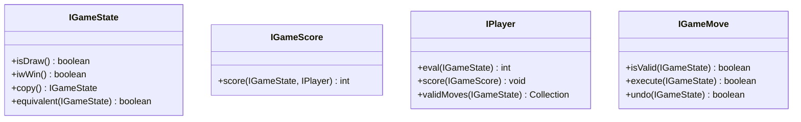

# Route search using AI

+ game tree
  + 2 players
+ search tree
  + 1 players

## game tree

use object



+ think point
  + static evaluation function
  + state expression
  + calculation of effort
  + limit of extended depth

## minimax

[source code](./erlang_code/route_search/minimax.erl)

<details><summary>search logic</summary>

```erlang
best_move(State, MainPlayer) ->
    PlyDepth = ?MAX_PLYDEPTH,
    minimax(State, PlyDepth, MainPlayer, null, null).

% minimax(GameState, PlyDepth, MainPlayer) -> {Move, Score}.
-spec minimax(list(), integer(), map(), map(), integer()) -> {map(), integer()}.
minimax(GameState, PlyDepth, MainPlayer, Move, Score)  ->
    case is_leaf_scene(GameState, PlyDepth) of
        true ->
            NewScore = evaluate_score(GameState, MainPlayer),
            ?OUTPUT_DEBUG(
                "minimax - depth: ~w, side: ~w,move: ~w, score: ~w to ~w", 
                [PlyDepth,
                    MainPlayer#player_record.side,
                    Move,
                    Score,
                    NewScore]),
            show_state_list(GameState),
            {Move, NewScore};
        false ->
            EmptyPositions = get_null_positions(GameState),
            minimax(
                GameState, 
                PlyDepth, 
                MainPlayer, 
                EmptyPositions , 
                null, 
                get_side_min_score(MainPlayer#player_record.side))
    end.

-spec minimax(list(), integer(), map(), list(), map(), integer()) -> {map(), integer()}.
minimax(_, _, _, [], Move, Score) -> 
    {Move, Score};
minimax(GameState, PlyDepth, MainPlayer, EmptyPositions, Move, Score) ->
    [EmptyPosition | EmptyPositionRetain] = EmptyPositions,
    ?OUTPUT_DEBUG(
        "side: ~w, empty position: ~w.",
        [MainPlayer#player_record.side,
         EmptyPosition]),
    GameStateAfterPlayer = set_game_state(GameState, MainPlayer, EmptyPosition),
    {_, OpponentScore} = minimax(
        GameStateAfterPlayer, 
        PlyDepth - 1, 
        get_opponent_player(MainPlayer), 
        Move, 
        Score),
    show_state_list(GameStateAfterPlayer),
    ?OUTPUT_DEBUG(
        "after minimax - side: ~w, score: ~w to ~w.",
        [MainPlayer#player_record.side,
        Score,
        OpponentScore]),
    NeedExchangeMove = need_exchange_move(
        get_opponent_player(MainPlayer),
        Move, 
        Score, 
        OpponentScore),
    {NewMove, NewScore} = case NeedExchangeMove of
        true -> 
            {EmptyPosition, OpponentScore};
        _ -> {Move, Score}
    end,
    ?OUTPUT_DEBUG(
        "minimax - depth: ~w, side: ~w,move: ~w to ~w, score: ~w to ~w", 
        [PlyDepth,
            MainPlayer#player_record.side,
            Move,
            NewMove,
            Score,
            NewScore]),
    minimax(GameState, PlyDepth, MainPlayer, EmptyPositionRetain, NewMove, NewScore).
```

</details>

## NegMax

opponent worst case is best case.

[source code](./erlang_code/route_search/negmax.erl)

<details><summary>search logic</summary>

```erlang
best_move(State, MainPlayer) ->
    PlyDepth = ?MAX_PLYDEPTH,
    negmax(State, PlyDepth, MainPlayer, null, null).

% negmax(GameState, PlyDepth, MainPlayer, Move, Score) -> {Move, Score}.
-spec negmax(list(), integer(), map(), map(), integer()) -> {map(), integer()}.
negmax(GameState, PlyDepth, MainPlayer, _, _) -> 
    case is_leaf_scene(GameState, PlyDepth) of
        true -> 
            Score = evaluate_score(GameState, MainPlayer),
            ?OUTPUT_DEBUG(
                "negmax - arrival leaf. score is ~w. side is ~w.",
                [Score, MainPlayer#player_record.side]),
            {null, Score};
        false -> 
            EmptyPositions = get_null_positions(GameState),
            negmax(
                GameState, 
                PlyDepth, 
                MainPlayer, 
                EmptyPositions , 
                null,
                null)

    end.

negmax(_, _, _, [], Move, Score) -> {Move, Score};
negmax(GameState, PlyDepth, MainPlayer, EmptyPositions, Move, Score) ->
    [EmptyPosition | EmptyPositionRetain] = EmptyPositions,
    GameStateAfterPlayer = set_game_state(GameState, MainPlayer, EmptyPosition),
    {_, OpponentScore} = negmax(
        GameStateAfterPlayer, 
        PlyDepth - 1, 
        get_opponent_player(MainPlayer), 
        Move, 
        Score),
    NeedExchangeMove = need_exchange_move(
        Score, 
        OpponentScore),
    {NewMove, NewScore} = case NeedExchangeMove of
        true -> 
            case PlyDepth of
                ?MAX_PLYDEPTH ->
                    ?OUTPUT_DEBUG(
                        "negmax - depth: ~w, side: ~w,move: ~w to ~w, score: ~w to ~w", 
                        [PlyDepth,
                            MainPlayer#player_record.side,
                            Move,
                            EmptyPosition,
                            Score,
                            OpponentScore]);
                _ -> ok
            end,
            {EmptyPosition, (-1 * OpponentScore)};
        _ -> {Move, Score}
    end,
    negmax(GameState, PlyDepth, MainPlayer, EmptyPositionRetain, NewMove, NewScore). 

-spec need_exchange_move(integer() | nulll, integer()) -> true | false.
need_exchange_move(null, _) -> true;
need_exchange_move(OldScore, NewScore) ->
    ((-1 * NewScore) > OldScore).
```

</details>

## Alpha Beta

[source code](./erlang_code/route_search/alpha_beta.erl)

<details><summary>search logic</summary>

```erlang
best_move(State, MainPlayer) ->
    PlyDepth = (?MAX_PLYDEPTH),
    alpha_beta(State,
               PlyDepth,
               MainPlayer,
               null,
               null,
               ?LOSE_SCORE,
               ?WIN_SCORE).

alpha_beta(GameState, PlyDepth, MainPlayer, Move, Score,
           Low, High) ->
    case allow_thinking(GameState, PlyDepth) of
        true ->
            alpha_beta(GameState,
                       PlyDepth,
                       MainPlayer,
                       get_valid_move(GameState),
                       Move,
                       Score,
                       Low,
                       High);
        false ->
            ?OUTPUT_DEBUG("alpha_beta - arrival leaf: ~w",
                          [GameState]),
            {null, evaluate_score(GameState, MainPlayer)}
    end.

alpha_beta(GameState, _, _, [], Move, Score, _, _) ->
    ?OUTPUT_DEBUG("alpha_beta: valid moves not found: ~w",
                  [GameState]),
    {Move, Score};
alpha_beta(GameState, PlyDepth, MainPlayer, ValidMoves,
           Move, Score, Low, High) ->
    [ValidMove | ValidMovesRetain] = ValidMoves,
    MovedGameState = set_move(GameState,
                              MainPlayer,
                              ValidMove),
    {_, OpponentScore} = alpha_beta(MovedGameState,
                                    PlyDepth - 1,
                                    get_opponent_player(MainPlayer),
                                    null,
                                    null,
                                    High * -1,
                                    Low * -1),
    {NewMove, NewScore, NewLow} = case
                                      need_exchange_score(Score, OpponentScore)
                                      of
                                      true ->
                                          {ValidMove,
                                           Low * -1,
                                           OpponentScore * -1};
                                      false -> {Move, Score, Low}
                                  end,
    case NewLow >= High of
        true -> {NewMove, NewScore};
        false ->
            alpha_beta(GameState,
                       PlyDepth,
                       MainPlayer,
                       ValidMovesRetain,
                       NewMove,
                       NewScore,
                       NewLow,
                       High)
    end.
```

</details>

## Depth-First Search

[source code](./erlang_code/graph_search/depth_first_search.erl)

<details><summary>search logic</summary>

```erlang
search(GameState) -> 
  GameStateStack = queue:new(),
  InitialGameStateStack = queue:in(GameState, GameStateStack),
  ClosedList = [],
  search(InitialGameStateStack, ClosedList).

% GameStateStack -> game state queue.
% ClosedList -> already scene game state
% PlyDepth -> think depth
-spec search(list(game_state_record), list(game_state_record)) -> {solution | no_solution, list(game_state_record)}.
search(GameStateStack, ClosedList) ->
  StackSize = queue:len(GameStateStack),
  case StackSize of
    0 -> 
      {no_solution, ClosedList};
    _ ->
      GameState = queue:last(GameStateStack),
      PopedGameStateStack = queue:liat(GameStateStack),
      case GameState#game_state_record.move of
        null ->
          ?OUTPUT_DEBUG("move is ~w", [null]),
          show_state(GameState#game_state_record.states);
        _ -> ok
      end,
      UpdatedClosedList = ClosedList ++ [GameState],
      Moves = get_valid_move(GameState#game_state_record.states),
      search(GameState, PopedGameStateStack, UpdatedClosedList, Moves)
  end.

search(_, GameStateStack, ClosedList, []) -> 
  search(GameStateStack, ClosedList);
search(GameState, GameStateStack, ClosedList, Moves) ->
  [Move|MovesRetain] = Moves,
  NullPosition = get_null_value_state_record(GameState#game_state_record.states),
  {_, MovedStates} = move_position(GameState#game_state_record.states, Move),
  MovedGameStates = #game_state_record{
    depth=GameState#game_state_record.depth + 1,
    move=NullPosition#state_record.position, 
    states=MovedStates
  },
  ExistsClosed = exists_states(MovedStates, ClosedList),
  IsGoal = is_goal_state(MovedStates),
  InRangeDepth = MovedGameStates#game_state_record.depth < ?MAX_DEPTH,
  {Result, UpdatedGameStackState, UpdatedClosedList} = case {ExistsClosed, IsGoal, InRangeDepth} of
    % arrival goal
    {false, true, _} -> 
      AddGoalSceneClosedList = ClosedList ++ [MovedGameStates],
      {goal, GameStateStack, AddGoalSceneClosedList};

    % not arrival goal and depth in range
    {false, false, true} ->
      AddedGameStateStack = queue:in(MovedGameStates, GameStateStack),
      {not_goal, AddedGameStateStack, ClosedList};

    _ ->
      {not_goal, GameStateStack, ClosedList}
  end,
  case Result of
    goal ->
      {solution, UpdatedClosedList};
    _ ->
      search(GameState, UpdatedGameStackState, UpdatedClosedList, MovesRetain)
  end.
````

</details>

## Breadth-First Search

[source code](./erlang_code/route_search/breadth_first_search.erl)

<details><summary>search logic</summary>

```erlang
-spec search(game_state_record) -> {solution | not_solution, list(game_state_record)}.
search(GameState) ->
  OpenQueue = queue:new(),
  InitializedOpenQueue  = queue:in(GameState, OpenQueue),
  ClosedGameStateLisst = [],
  search(InitializedOpenQueue, ClosedGameStateLisst).

-spec search(list(game_state_record), list(game_state_list)) -> 
  {solution|not_solution, list(game_state_list)}.
search(OpenQueue, ClosedList) ->
  case queue:len(OpenQueue) of
    0 -> {no_solution, ClosedList};
    _ ->
      {{value, HeadGameState}, HeadedOpenQueue} = queue:out(OpenQueue),
      AddedClosedList = [HeadGameState] ++ ClosedList,
      ValidMoves = generate_valid_moves(HeadGameState),
      search(HeadedOpenQueue, AddedClosedList, HeadGameState, ValidMoves)
  end.

-spec search(
    list(game_state_record), 
    list(game_state_record), 
    game_state_record,
    list({integer(), integer()})) ->
  {solution|not_solution, list(game_state_list)}.
search(OpenQueue, ClosedList, _, []) ->
  search(OpenQueue, ClosedList);
search(OpenQueue, ClosedList, GameState, Moves) ->
  [Move|MoveRetain] = Moves,
  % for route trace
  NullPositionBeforeMove = get_null_position(
    GameState#game_state_record.board_records),
  MovedGameState = calculate_moved_game_state(GameState, Move),
  ExistsClosedList = exists_closed_list(MovedGameState, ClosedList),
  IsGoal = is_goal_game_state(MovedGameState),
  {Result, NewOpenQueue, NewClosedList} = case {ExistsClosedList, IsGoal} of
    % arrival goal
    {false, true} ->
      ChangeMovedGameState = MovedGameState#game_state_record{move=NullPositionBeforeMove},
      AddFinishedClosedList = ClosedList ++ [ChangeMovedGameState],
      {solution, OpenQueue, AddFinishedClosedList};
    {false, _} ->
      ?OUTPUT_DEBUG(
        "search - add queue (null: ~w, move: ~w)",
        [NullPositionBeforeMove, Move]),
      ChangeMovedGameState = MovedGameState#game_state_record{move=NullPositionBeforeMove},
      AddMovedOpenQueue = queue:in(ChangeMovedGameState, OpenQueue),
      {no_solution, AddMovedOpenQueue, ClosedList};
    _ ->
      {no_solution, OpenQueue, ClosedList}
  end,
  case Result of
    solution ->
      {solution, NewClosedList};
    _ ->
      search(NewOpenQueue, NewClosedList, GameState, MoveRetain)
  end.
```

</details>

## A* Search

Score Evaluator

 + FairEvaluator
   + summary of manhattan distance what position to correct position.(P(n))
 + GoodEvaluator
   + P(n) + 3 * S(n).
   + S(n) is summary of outer score
     + correct -> 0
     + incorrect -> 2
     + center piece -> 1
 + WeakEvaluator
   + invalid position count
 + BadEvaluator
   + score is 16 - summary of delta what other side.ignore the center.

[source code](./erlang_code/route_search/aster.erl)

<details><summary>search logic</summary>

```erlang
% EvaluatorType -> 
%   fair_evaluator | good_evalueator | weak_evalueator | bad_evaluator
-spec search(game_state_record, atom()) -> 
  {solution | not_solution, list(game_state_record)}.
search(InitialGameState, EvaluatorType) ->
  OpenGameStateList = [InitialGameState],
  ClosedGameStateList = [],
  search(
    OpenGameStateList, 
    ClosedGameStateList, 
    EvaluatorType).

-spec search(list(game_state_record), list(game_state_record), atom()) -> 
  {solution | not_solution, list(game_state_record)}.
search([], ClosedGameStateList, _) ->
  {not_solution, ClosedGameStateList};
search(OpenGameStateList, ClosedGameStateList, EvaluatorType) ->
  {GameState, RemovedOpenGameStateList} = 
    get_minimum_priority_game_state(OpenGameStateList),
  ArrivalGoal = is_goal_game_state(GameState),
  case ArrivalGoal of
    true ->
      % add goal game state
      AddGoalClosedGameStateList = 
        [GameState] ++ ClosedGameStateList,
      {solution, AddGoalClosedGameStateList};
    false ->
      AddedClosedGameStateList = [GameState] ++ ClosedGameStateList,
      ValidMoves = generate_valid_moves(GameState),
      search(
        GameState,
        RemovedOpenGameStateList, 
        AddedClosedGameStateList, 
        EvaluatorType,
        ValidMoves 
       )
  end.

-spec search(
    game_state_record, 
    list(game_state_record), 
    list(game_state_record), 
    atom(), 
    list(move_record)) -> 
  {solution | not_solution, list(game_state_record)}.
search(_, OpenGameStateList, ClosedGameStateList, EvaluatorType, []) ->
  search(OpenGameStateList, ClosedGameStateList, EvaluatorType);
search(GameState, OpenGameStateList, ClosedGameStateList, EvaluatorType, Moves) ->
  [Move|MoveRetain] = Moves,
  MovedGameState = execute_move(GameState, Move),
  ExistsCloseList = exists_game_state_list(MovedGameState, ClosedGameStateList),
  ExistsOpenGameState = find_game_state(MovedGameState, OpenGameStateList),
  ScoreAfterMove = evaluate_score(MovedGameState, EvaluatorType),
  ScoredMovedGameState = MovedGameState#game_state_record{score=ScoreAfterMove},
  {NextOpenGameStateList} = case {ExistsCloseList, ScoredMovedGameState#game_state_record.depth, ExistsOpenGameState} of
    % exists closed list
    {true, _, _} ->
      {OpenGameStateList};

    % arrival max depth
    {false, ?MAX_DEPTH, _} ->
      {OpenGameStateList};

    % open state not exists
    {false, _, null} ->
      AddNextStateOpenGameStateList = 
        [ScoredMovedGameState] ++ OpenGameStateList,
      {AddNextStateOpenGameStateList};

    % open state exists
    {false, _, OpenGameState} ->
      % remove open game state and add moved game state
      RemovedGreaterSccore = 
        remove_greater_score_game_state(
          ScoreAfterMove, 
          OpenGameState, 
          OpenGameStateList),
      AddNextStateOpenGameStateList = 
        [ScoredMovedGameState] ++ RemovedGreaterSccore,
      {AddNextStateOpenGameStateList}
  end,
  search(
    GameState, 
    NextOpenGameStateList, 
    ClosedGameStateList, 
    EvaluatorType, 
    MoveRetain).
```

</details>